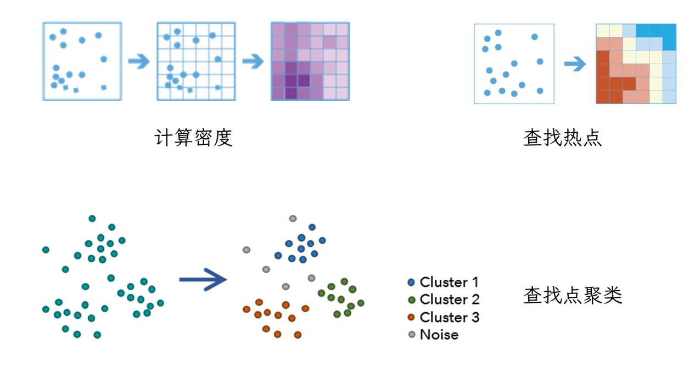
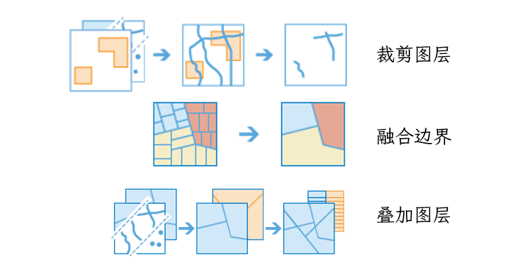

???+ Abstract
    
    这一章基本是ArcGIS Pro工具的介绍，内容不太好总结，工具介绍的部分基本都是直接搬的ArcGIS Pro官方帮助文档，稍微做了点整理。
     
## 1. 地理空间大数据

### 1.1 概念

**大数据**是大到无法用常规的数据库管理系统进行有效处理的数据集 (Dasgupta, 2013)。

**地理空间大数据**是指超出现有计算系统容量的空间数据集。

### 1.2 大数据的特点——5V

* Volume 体量大：采集、存储和计算量庞大

* Velocity 速度快：数据增长速度快，处理速度（要求）快

* Variety 模态多：种类和来源多样化

* Veracity 真伪难辨：数据的准确性和可信度低

* Value 价值低：数据的价值密度相对较低

### 1.3 大数据技术体系

数据、算法、算力、平台。

### 1.4 大数据五大核心邻域

* 数据存储与计算：实现海量数据的高效存储与计算

* 数据管理：实现数据质量提升、管理高效

* 数据流通：数据的合理配置

* 数据应用：发挥数据的价值

* 数据安全：数据的有效保护和合法利用

### 1.5 大数据的来源

* 用户生成，如聊天信息。

* 传感器数据，如手机GPS、WIFI、蓝牙、摄像头，卫星，无人机 …

* 各种智能设备产生，如监控设备、个人电脑、智能穿戴 …

* ……

### 1.6 地理空间大数据面临的挑战

1. 数据库设计

    应对多种多样、大容量、需要高效读写的数据。

2. 计算系统

    个人电脑通常不能处理大容量数据，或无法快速处理数据。

3. 网络限制

    快速传输大容量数据。

4. 算法和方法

    大数据的5V特性挑战着传统的理解数据的算法和方法。

5. 地理可视化

    实现对大量数据的快速可视化。

## 2. 地理空间大数据分析方法

### 2.1 ArcGIS中的工具

1. GeoAnalytics Desktop工具

    !!! tip inline end "Apache Spark"
    
        [Apache Spark](https://spark.apache.org/)是用于大型数据集的开源数据处理引擎，提供了大数据所需的计算速度、可扩展性和可编程性。 

    GeoAnalytics Desktop 工具提供了一个并行处理框架，以使用 Apache Spark 在**桌面计算机**上进行分析。 
    
    通过**聚合、回归、检测和聚类**，可以可视化、理解大数据并与其进行交互。 这些工具可与大数据集配合使用，使得能够通过模式、趋势和异常来深入了解数据。 

    1. 分析模式工具

        * 计算密度

            根据落入每个单元周围邻域内的点要素计算每单位面积的量级。

        * 查找热点
             
            给定一组要素，使用 [Getis-Ord Gi*](../6_SpaCorr/#hot_spot) 统计识别具有统计显著性的热点和冷点。

        * 查找点聚类
    
            基于点要素的空间或时空分布查找周围噪点内的点要素聚类。

        * 基于森林的分类与回归

            使用随机森林算法生成预测，可以针对离散变量（分类）和连续变量（回归）执行预测。

        * 广义线性回归

            执行[广义线性回归 (GLR)](../7_Regression/#28) 以生成预测，或对因变量与一组解释变量的关系进行建模。 此工具可用于拟合连续 (OLS)、二进制（逻辑）和计数（泊松）模型。
        
        下图展示了其中几种分析模式工具的效果：
        
        {.img}

        ???+ quote "Referece"
            
            [分析模式工具集](https://pro.arcgis.com/zh-cn/pro-app/latest/tool-reference/geoanalytics-desktop/an-overview-of-the-analyze-patterns-toolset.htm)

    2. 数据丰富工具

        * 计算动态统计数据
             
            计算启用时间的要素类中点的动态统计数据。

        ???+ quote "Referece"
            
            [计算动态统计数据](https://pro.arcgis.com/zh-cn/pro-app/latest/tool-reference/geoanalytics-desktop/calculate-motion-statistics.htm)           

    3. 查找位置工具

        * 检测事件
            
            创建一个新图层，图层中包含检测出的事件。

        * 查找停留位置

            使用给定的时间和距离阈值来查找移动对象已停止或停留的位置。停留位置被定义为在一定时间内极少移动或没有移动的连续观测点。 根据具体的应用领域，可将其称为停留点或空闲检测。

        * 查找相似位置
            
            根据要素的属性识别与单个或多个输入要素最相似或者最不相似的候选要素。
        
        {.img}

        ???+ quote "Referece"
            
            [计算动态统计数据](https://pro.arcgis.com/zh-cn/pro-app/latest/tool-reference/geoanalytics-desktop/calculate-motion-statistics.htm)        

    4. 管理数据工具
        
        * 计算字段
        
            可使用计算的字段值创建图层。

        * 裁剪图层
            
            从指定的多边形中提取输入要素。

        * 融合边界
            
            查找相交或具有相同字段值的面，并将其合并为一个面。

        * 叠加图层

            将多个图层中的几何叠加到一个图层中。 叠加可用于合并、擦除、修改或更新空间要素。
        
        {.img}

        ???+ quote "Referece"
            
            [管理数据工具集](https://pro.arcgis.com/zh-cn/pro-app/latest/tool-reference/geoanalytics-desktop/an-overview-of-the-manage-data-toolset.htm)               

    5. 汇总数据工具

        * 聚合点
        
            将点聚合到面要素或图格。这个工具将返回一个多边形，其中包含点计数以及所有存在点的位置的可选统计数据。

        * 描述数据集

            将要素汇总到所计算的字段统计信息、样本要素和范围边界中。

        * 重新构建轨迹

            从启用时间的输入数据创建线或面轨迹。

        * 汇总属性
            
            针对要素类中的字段计算汇总统计数据。

        * 汇总中心和离差

            用于查找中心要素和方向分布，并根据输入计算平均和中位数位置。

            > 想了解中心要素、平均中心和中位数中心可参考：[中心要素](https://mp.weixin.qq.com/s?__biz=MzA4ODk4NzgyNA==&mid=2649737283&idx=1&sn=563c2bbeff0212d300301ecb6583c71f&chksm=883aa99cbf4d208a379ea789eb9cd5f11320f3ed75ed6f318c59902df69a28cef0ddb3835b3c&scene=178&cur_album_id=1349424235982290944#rd), [平均中心](https://mp.weixin.qq.com/s?__biz=MzA4ODk4NzgyNA==&mid=2649737486&idx=1&sn=fa0741f8d45f20169113f9fc6cd6d20d&chksm=883aa8d1bf4d21c7f042daa8f77211967e50fe2d4c796905ff4072df8e904ce98418dcba6fd3&cur_album_id=1349424235982290944&scene=189#wechat_redirect), [中位数中心](https://mp.weixin.qq.com/s?__biz=MzA4ODk4NzgyNA==&mid=2649737586&idx=1&sn=d97a71bfaa9572275fa5f7e2a864c2ac&chksm=883aa8adbf4d21bb9474cb04691826e384f90f51c7eb3090a894cf0cd9e7f0fca4548c3da156&scene=178&cur_album_id=1349424235982290944#rd)。

        * 范围内汇总

            将一个面图层与另一个图层叠加，以便汇总各面内点的数量、线的长度或面的面积，并计算面内此类要素的属性字段统计数据。
        
        

        ???+ quote "Referece"
            
            [汇总数据工具集](https://pro.arcgis.com/zh-cn/pro-app/latest/tool-reference/geoanalytics-desktop/an-overview-of-the-summarize-data-toolset.htm)
        

    6. 邻近分析工具

        * 创建缓冲区
    
            在输入要素周围某一指定距离内创建缓冲区。

        * 按邻近性分组
        
            可对空间或时空上彼此接近的要素进行分组。
        
        * 捕捉轨迹
        
            用于将输入轨迹点捕捉到线。 启用时间的点数据必须包含表示时刻的要素。 分析需要具有指示起始节点和终止节点的字段的可遍历线。
        
        * 追踪邻近事件
        
            追踪在空间（位置）和时间上彼此邻近的事件。 启用时间的点数据必须包含表示时刻的要素。
        
        ???+ quote "Referece"
            
            [邻近分析工具集](https://pro.arcgis.com/zh-cn/pro-app/latest/tool-reference/geoanalytics-desktop/an-overview-of-the-use-proximity-toolset.htm)       
        
        

    7. 实用工具

        * 多文件要素连接工具

            多文件要素连接工具集可创建和修改多文件要素连接，以便在地理处理工具中使用。
        
        ???+ quote "Referece"
            
            [多文件要素连接工具集](https://pro.arcgis.com/zh-cn/pro-app/latest/tool-reference/geoanalytics-desktop/an-overview-of-the-big-data-connections-toolset.htm)         

2. GeoAnalytics Server工具

    GeoAnalytics Server 工具箱包含一组功能强大的工具，可用于对大数据执行空间分析。GeoAnalytics 工具 受 ArcGIS GeoAnalytics Server 支持。ArcGIS GeoAnalytics Server 可在多个服务器节点间分配分析。通过使用分布式处理，可在更短的时间内处理大型数据集。

    GeoAnalytics Server中的的工具与GeoAnalytics Desktop相同，但是在以下情况，使用GeoAnalytics Server更好：

    * 数据存储在托管要素图层中。

    * 分析输出将位于 ArcGIS Enterprise 中。

    * 将使用多台计算机分发分析。

    * Linux、Web 应用程序或服务器计算机将用于完成分析。
    
    * 将使用文件集合（例如分隔文件或 shapefile）或大数据文件共享源（例如云存储、HDFS 或 Hive）。

    ???+ quote "Referece"

        [GeoAnalytics Server](https://pro.arcgis.com/zh-cn/pro-app/latest/tool-reference/big-data-analytics/an-overview-of-the-big-data-analytics-toolbox.htm)

        [GeoAnalytics Desktop](https://pro.arcgis.com/zh-cn/pro-app/latest/tool-reference/geoanalytics-desktop/an-overview-of-the-geoanalytics-desktop-toolbox.htm)    

3. 其它方法

    * [时空模式挖掘工具](https://pro.arcgis.com/zh-cn/pro-app/latest/tool-reference/space-time-pattern-mining/an-overview-of-the-space-time-pattern-mining-toolbox.htm)

    * [Image Analyst](https://pro.arcgis.com/zh-cn/pro-app/latest/tool-reference/image-analyst/an-overview-of-the-image-analyst-toolbox.htm)

### 2.2 其它平台或开源方法

* [Google Earth Engine](https://developers.google.com/earth-engine/datasets/)

* [Supermap](https://www.supermap.com/)

* [Movebank](https://www.movebank.org/cms/movebank-main)：分析动物运动数据的地理空间大数据平台。

* [航天宏图 Pie Engine](https://engine.piesat.cn/)

* [The latest in Machine Learning | Papers With Code](https://paperswithcode.com/)

* [GitHub (Let’s build from here)](https://github.com/)

* ……