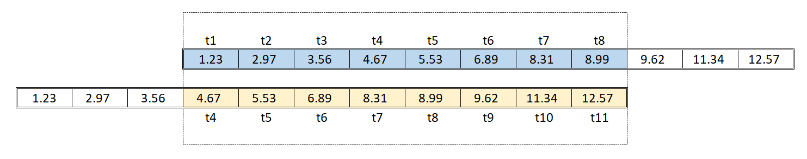
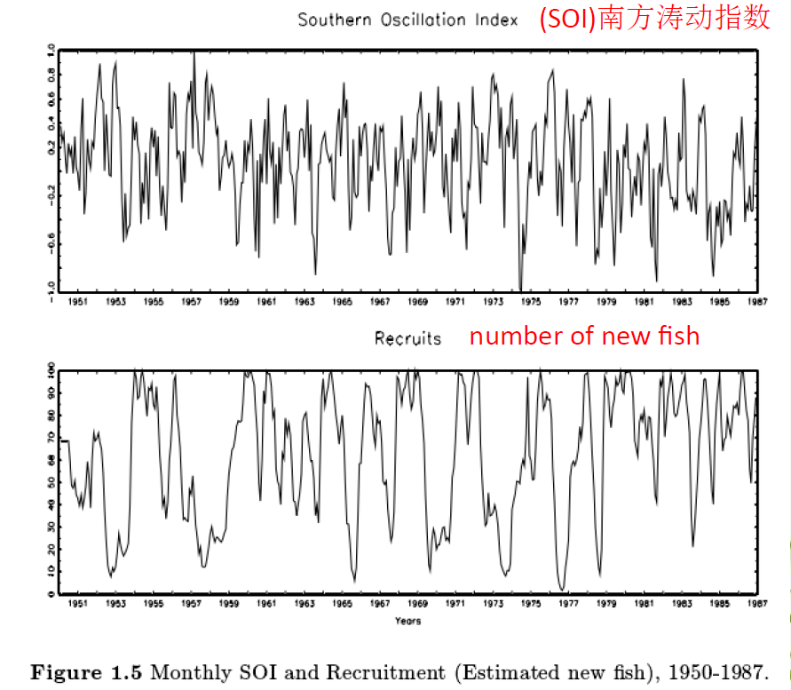
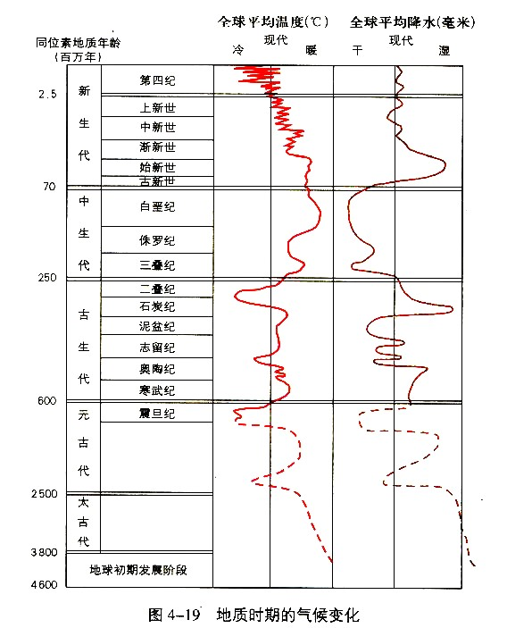
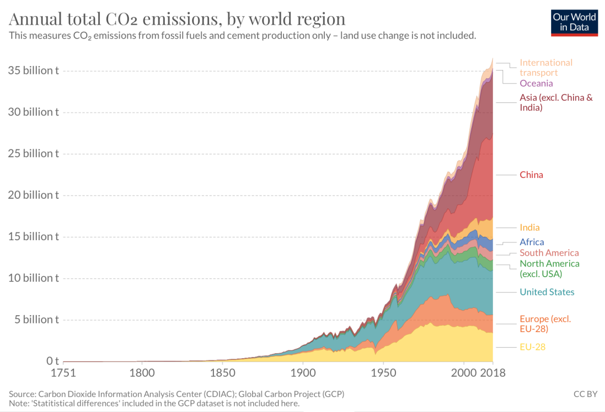
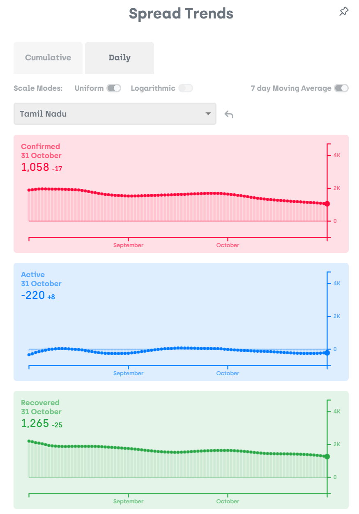

???+ Abstract
    
    简单介绍了时间序列分析的内容。

## 1. 时间序列分析基础

### 1.1 概念

**时间序列** 是指将某种现象的指标数值按照时间顺序排列而成的数值序列。通常一组时间序列的时间间隔为一恒定值（如1秒，5分钟，12小时，7天，1年），因此时间序列可以作为离散时间数据进行分析处理。

**时间序列分析** 是指从按时间排序的数据点中抽取有价值的总结和统计信息的行为，其试图解释随时间变化的数据点可能具有的内部结构（如自相关、趋势、周期或季节性变化）。

### 1.2 时间序列分解

时间序列的趋势分解公式：
$$
Y_t = f(T_t, S_t, C_t, I_t)
$$

* $T_t$：长期趋势（Trend），指在较长时期内的变动
    
    线性趋势（Linear Trend）      
    非线性趋势（Non-linear Trend）

!!! note inline end "区分Cyclical和Seasonal"

    如果波动不是固定周期的，那么称其为周期性的（Cyclic）；

    如果波动周期基本不变且与日历日期有关联，那么称其为季节性的（Seasonal）.

* $S_t$：季节变动（Seasonal），由季节性因素引起的周期性变动

* $C_t$：循环变动（Cyclic/Cyclical），呈现由高到低再到高的反复循环变动

* $I_t$：不规则变动（Irregular），不可预见的偶然因素影响

其中由于循环变动识别比较复杂，应用时常常简化如下：

$$
Y_t = f(T_t, S_t, I_t)
$$

* $T_t$：递增或递减的变化趋势

* $S_t$：同期相同幅度和方向变化趋势

* $I_t$：随机效应

时间序列常常是多种分解因子共同作用的结果。

### 1.3 时间序列模型

!!! note inline end "加法模型和乘法模型的选择"

    **季节性波动的幅度** 或 **围绕趋势和周期的变化** 不随时间序列的水平变化时，加法模型更合适；

    **季节性的变化** 或 **趋势和周期造成的变化** 似乎与时间序列水平成正比时，乘法模型更合适。

* 加法模型：四种（或三种）因素相互独立，互不影响
$$
Y_t = T_t + S_t + C_t + I_t \\\
Y_t = T_t + S_t + I_t
$$

* 乘法模型：四种（或三种）因素相互影响，互不独立
$$
Y_t = T_t \times S_t \times C_t \times I_t \\\
Y_t = T_t \times S_t \times I_t
$$

    乘法模型转换为加法模型的两种方法：

    1. 先把数据转换至时间序列随时间平稳变化，再利用加法模型；

    2. 使用对数转换：
    $$
    log \ Y_t = log \ T_t + log \ S_t + log \ C_t + log \ I_t
    $$

???+ quote "Refrence"

    [时间序列分析的基础、原理、算法和应用](https://zhuanlan.zhihu.com/p/659263728)

## 2. 时间序列分析方法

### 2.1 移动平均（Moving average）

* 移动平均模型(MA)

    使用时间序列中最近的n个数据值预测下一个数据值。包括:

    简单移动平均（simple moving average, SMA）
    $$
    \hat y_{t+1} = \frac{\sum_{j=0}^{n-1} y_{t-j}}{n} = \frac{y_t + y_{t-1} + … + y_{t-n+1}}{n} = \hat y_t + \frac{y_t - y_{t-n}}{n}
    $$
    
    加权移动平均（weighted moving average, WMA）
    $$
    \hat y_{t+1} = \frac{\sum_{j=0}^{n-1} \omega_{n-j} y_{t-j}}{\sum_{i=1}^n \omega_i} = \frac{\omega_n y_t + \omega_{n-1} y_{t-1} + … + \omega_1 y_{t-n+1}}{\omega_1 + \omega_2 + ... + \omega_n}
    $$
    一种常见的权重取值方案是根据时间线性递减，将最近时间点的权重设为滑动窗口的大小n：
        $$
    \hat y_{t+1} = \frac{\sum_{j=0}^{n-1} (n-j) y_{t-j}}{\sum_{i=1}^n \omega_i} = \frac{n y_t + (n-1) y_{t-1} + … + y_{t-n+1}}{n(n+1)/2}
    $$

* 预测精度评价——均方误差(MSE)

$$
MSE = \frac {\sum_{i=1}^{n} (y_i - \hat y_i)^2}{n}
$$ 

### 2.2 指数平滑（Exponetial smoothing）

指数平滑也可以视为一种特殊的加权移动平均：指数移动平均（Exponential Moving Average，EMA）。在指数平滑里，只选择最近的观测值进行加权：

$$
\hat y_{t+1} = \sum_{j=0}^{n-1} \alpha(1-\alpha)^j y_{t-j} = \alpha y_t + (1-\alpha)\hat y_t
$$
其中 $\alpha \in (0,1)$ 表示权重衰减系数，$\alpha$ 越大，表示过去的观测值衰减的越快。一般来说，在数据波动较大的情况下，选择较大的 $\alpha$ 更合适，因为这样能够更快地适应数据的变化，当序列比较平稳时，选择较小的 $\alpha$ 更合适。也有一种 $\alpha$ 的计算方法：
$$
\alpha = \frac{2}{1+T}
$$
其中T表示滑动窗口的大小（周期）。

### 2.3 长期趋势（Long-term trend）

常见的时间序列趋势有：

* 线性趋势

$$
y_t = a+b_t
$$

* 指数趋势

$$
y_t = ab^t
$$

* 抛物线趋势

$$
y_t = a + b_t + ct^2
$$

可以使用[回归分析](../7_Regression)方法获得趋势方程。

### 2.4 自回归模型（Auto-Regression Model）

自回归模型用历史值预测未来，即AR模型的基础是认为过去发生的数据能够用来预测未来的数据（也就是数据之间是非独立的），同时AR模型要求时间序列数据是平稳的。

* 自相关系数

    自相关系数(Autocorrelation Coefficient, AC)度量的是同一事件在两个不同时期之间的相关程度，形象的讲就是度量自己过去的行为对自己现在的影响。

    自相关函数(Autocorrelation Function, ACF)是自相关系数构成的序列。

    k阶自相关系数表示 $x_t-k$与$x_t$之间的相关性，k代表滞后阶数(时间间隔)，如下是一个3阶自相关系数的例子：
    
    

    自相关系数计算方式为：
    
    $$
    \begin{aligned}
    ACF(k) = \frac{c_k}{c_0} &= \frac{\frac{1}{n-k}\sum_{t=1}^{n-k}(x_t-\bar x)(x_{t+k} - \bar x)}{\frac{1}{n} \sum_{t=1}^n (x_t-\bar x)^2} \ \ &(无偏) \\\\
    &= \frac{\sum_{t=1}^{n-k}(x_t-\bar x)(x_{t+k} - \bar x)}{ \sum_{t=1}^n (x_t-\bar x)^2} \ \  &(有偏)
    \end{aligned}
    $$
    其中，$\bar x$ 是整个序列数据的平均值。 

    所有时间序列在间隔0时的ACF值都为1，也就是时间序列和它本身之间具有完全的正相关性。 
    
    一个完全的白噪声序列，它在任何时间间隔的ACF都近似于0。

    对于任何一个时间序列，它在5%的置信度下的ACF值不显著为0的置信区间临界值为 $\pm \frac{1.96}{\sqrt{T-k}}$，其中T为样本量，k为时间间隔，从公式中可以得出，随着时间间隔k的增大，置信区间也不断增大，也就是说距离越远的相关性越不可信。

* AR模型  
    k阶自相关模型AR(k)具有如下形式：
    $$
    y_t = \phi_0 + \phi_1 y_{t-1} + \phi_2 y_{t-2} + ... + \phi_k y_{t-k} + \varepsilon_t
    $$
    其中，$\varepsilon_t$ 表示白噪声。

### 2.5 差分整合移动平均自回归模型（Auto Regressive Integrated Moving Average Model）

* 介绍

    ARIMA模型是ARMA模型的拓展。ARMA模型是AR和MA的简单结合，同时包含了历史数值项和错误项。由于AR模型对时间序列有平稳性要求，ARMA模型也存在这个限制，因此又将其拓展到ARIMA模型，引入的差分概念是一种获得时间序列的方法。最常使用的一种差分方法是计算当前项和前项的差值，获得一组新的时间序列。

    因此，ARIMA模型可应用于数据显示非平稳性证据的某些情况，其中初始差分步骤可以应用一次或多次以消除非平稳性。

    1. AR (自回归)部分表明，感兴趣的变量是根据其自身的滞后(即先验)值进行回归的。

    2. MA (移动平均)部分表明回归误差实际上是误差项的线性组合，其在过去的不同时间同时出现。

    3. I (差分整合)表示数据值已被替换为它们的值与前一个值之间的差值(这种差分过程可能执行不止一次)。这些过程的目的都是希望使模型尽可能地与数据拟合。

* ARIMA(p, d, q)

    ARIMA模型通常表示为ARIMA(p, d, q), 其中p表示AR的阶数，d表示差分次数，q表示MA的阶数。当某一项为0时，模型实际上可以简写（退化为更简单的模型），如p=1, d=0, q=0时，模型可写为AR(1)。

* 平稳性 (Stationarity) 和平稳性检验
    
    平稳性意味着生成时间序列过程中的统计特性不随时间改变。比如，如果某个时间序列具有递增的趋势，即序列中的值随时间增长而增大，则该序列不平稳。

    时间序列分析中两种常见的平稳性检验方法是：
    
    1. 滚动统计(Rolling statics)
    
        这种方法通常用于观察数据的趋势和周期性。实际上是利用一个滑动窗口，为窗口内的数据计算某种统计量，从而分析其在局部的结构或者说是短时的特性，从而更好地了解数据的动态变化。常见的滚动统计指标包括滚动均值（rolling mean）和滚动标准差（rolling standard deviation）。

    2. ADF检验(Augmented Dickey-Fuller Test) 

        ADF检验是一种单位根检验方法，当时间序列中存在单位根时，该序列是非平稳的。ADF检验在基于“时间序列不平稳”这一零假设的基础上进行检验，判断统计量计算结果是否能拒绝原假设，从而判断数据是否平稳。

        !!! note "时间序列中的单位根"

            什么样的序列存在单位根？一种最简单的情况是 $y_t = y_{t-1} + \varepsilon_t$，对应的特征根是1，计算可以得到 $y_t = \sum_{i=1}^\infty \varepsilon_{t-i}$, 在这种情况下，离当前时间很久之前的一个随机冲击对现在的影响仍然没有衰减，这就是单位根过程。如果时间序列存在这种情况，对时间序列的未来值的预测就难以进行。
    
* 消除非平稳性

    实际生活中的时间序列通常是非平稳的，需要先消去趋势和季节性等因素的影响，使时间序列平稳以便进行预测，在对预测值施加趋势和季节性因素的影响。

    常见的消除趋势和季节性的方法：

    1. 转换，如对数转换、平方转换、立方转换；  
    2. 取某段时间中的平均值；  
    3. 差分。

* 白噪声(white noise)检验

    白噪声序列（White Noise Series）也称纯随机序列，是最简单的平稳序列。白噪声序列中，序列值彼此之间没有任何相关性，这意味着该序列是一个没有记忆的序列，过去的行为对将来的发展没有丝毫影响，这样的平稳序列没有任何分析价值，不值得进行建模分析。

    Ljung Box检验(LB检验)是一种白噪声检验方法，如果序列前若干项相关系数都为零，那么检验统计量渐进服从于卡方分布，如果统计量的值在右端拒绝域内则可以拒绝原假设，判定该序列并非白噪声，可以进一步进行建模分析。

???+ quote "Refrence"

    [移动平均(Moving Average)](https://zhuanlan.zhihu.com/p/151786842)
    
    [自相关系数ACF（公式篇）](https://zhuanlan.zhihu.com/p/430503143)

    [时间序列分析](https://otexts.com/fppcn/)

    [TimeSeriesAnalysis101](https://skywateryang.gitbook.io/timeseriesanalysis101)
    
## 3. 时间序列分析的案例

### 3.1 南方涛动指数

{.img}

### 3.2 气候变化

**时间尺度**

* …  
* 万年  
* 千年  
* 世纪  
* … 

**应用**

1. 气候变化

    {.img}

2. 全球$CO_2$排放

    {.img}

### 3.3 COVID-19

{.img}