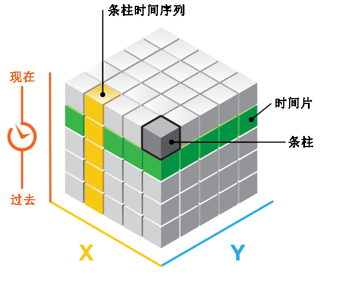
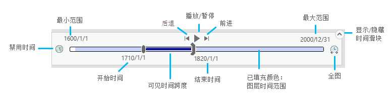
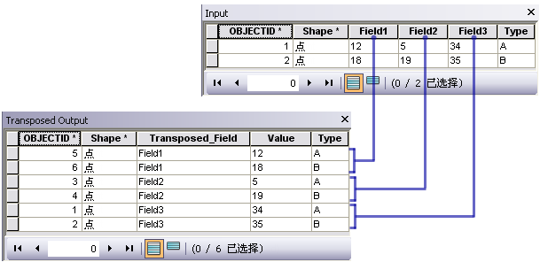
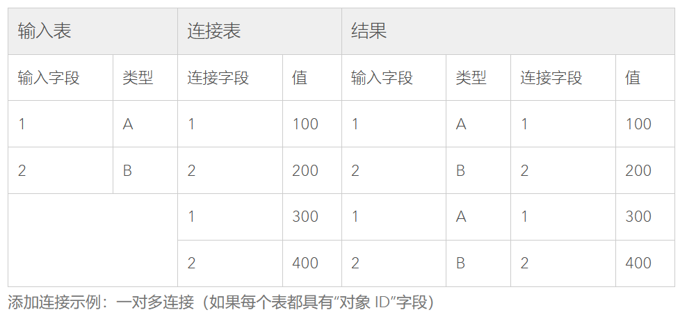
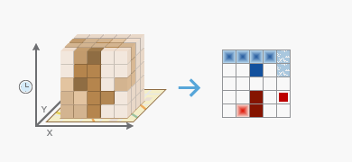
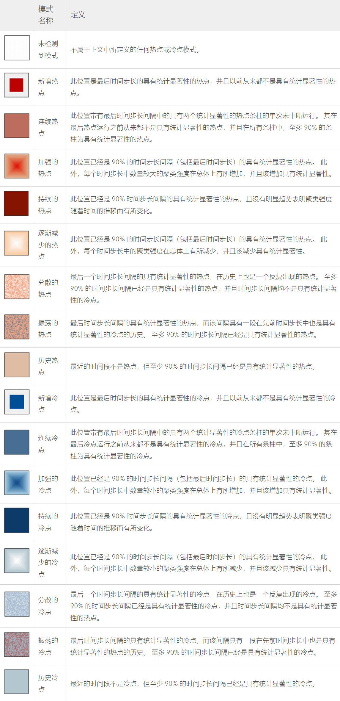
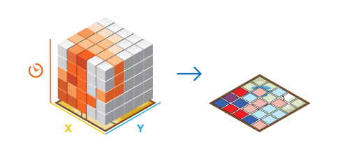
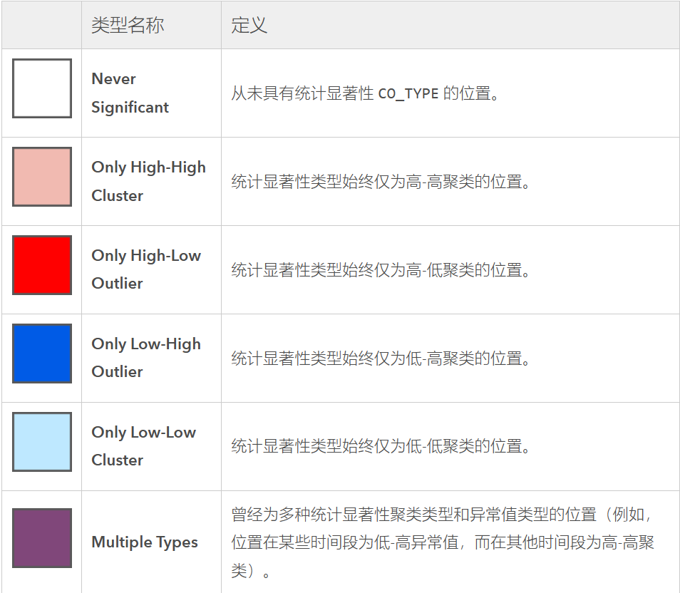
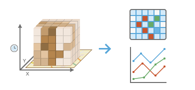

???+ Abstract
    
    这章主要基于ArcGIS Pro的工具介绍了时空分析的概念及一些方法。

    需要知道一些进行时空数据分析的工具。
    

## 1. “时空”的概念

### 1.1 “时空”（Spatio-Temporal）

* 时空
 
    时空（Spatio temporal/ST or spatial-temporal/spatiotemporal/ space-time/space time）数据是指既有空间信息（属性）又有时间信息（属性）的数据。

* 时空数据是指具有时空特征的数据

    时空数据描述的是在特定时间特定地点的现象，具有时空特征。

    1. 移动特征（Moving features）

        在空间不断移动的特征要素。如飞机、船、车辆、人、动物、风暴中心...

    2. 离散事件（Discrete events）

        发生在特定位置的事件。如犯罪、交通事故、地震、雷击、火山喷发...

    3. 固定记录器（Stationary recorders）

        记录某地发生的变化。如气象站、交通传感器、河流流量计...

    4. 随时间变化的特征（Change/growth）
    
        人口统计资料、火灾区域周长、洪水区范围...

### 1.2 时空数据类型

1. 事件点数据（Event data）

    在某个位置点、某个时间点发生的离散事件。如城市犯罪事件。

2. 轨迹数据（Trajectory data）

    移动物体的轨迹。如正在巡逻的警车。

3. 点参考数据（Point reference data）

    使用移动时空参考点描述连续时空场。如使用气象气球数据衡量地表温度。

4. 栅格数据（Raster data）

    在某个时空栅格单元收集对应时空场的观测值。如遥感影像数据。

### 1.3 “时间”的含义

* “时间”的观点

    线性的：每个时间点是唯一的，时间是有方向的

    循环的：在特定的时间范围内重复

    ...

* 与不同事物同步的时间：

    时钟驱动时间（Clock-driven time），如从流量计中获取的10分钟读数、从TikTok获取的15秒短视频、犯罪事件的发生；

    事件驱动事件（Event-driven time），如股票市场崩盘之前、火灾发生之后；

    状态驱动时间（State-driven time），如蝗虫爆发、森林火灾。

* 时空数据中的时间类型：

    1. 时间点
        
        有时间戳（time stamp）。

    2. 一段持续时间

        有起始和结束时间。

    3. 规则频率
    
        时间跨度恒定。如每隔十年进行人口普查。

    4. 不规则频率

        时间跨度不同。如地震发生时间不可预测。

## 2. 时空分析基础

### 2.1 内涵

时空(数据)分析借助新兴计算机技术的发展和应用，侧重于从（大）时空数据获取时空信息和知识。

### 2.2 时空数据分析平台
    
实现对时空数据的管理、可视化、分析、分享。

常见的有ArcGIS for Desktop, ArcGIS Pro, ArcGIS Portal, ArcGIS Online...

### 2.3 时空立方体

时空立方体本质是一种利用采样点特征表示时间和空间的向量数据结构，它显示出现象如何在地理空间内随时间变化。

多个具有时间或/和空间特征的点(均匀或非均匀)可以用来表示一个特定的时间段或表达聚合特征。

时空立方体有行(row)、列(column)和时间步长（time step，时空立方体的高），行和列决定空间范围，时间步长决定时间范围。

{.img}

!!! note inline end 

    这里bin的官方（ArcGIS Pro）中文翻译是条柱，感觉不太好，很容易被误解为同一位置的所有小立方体组成的细高长方体（条柱时间序列）。

条柱（bin）: 组成时空立方体的最小单元，是一个最小的单位立方体。每个条柱在空间 (x,y) 和时间 (t) 中都有固定位置。覆盖同一个 (x, y) 区域的条柱共用同一个位置 ID。包含相同持续时间的条柱共用相同的时间步长 ID。

条柱时间序列（bin time strides）：同一位置不同时间（位置ID相同，时间步长ID不同）的条柱（bin）组成的细长方体。

时间片（time slice）：不同位置相同时间的条柱组成的矮宽长方体。

由于点数据的分布不均，某些立柱内可能一个数据点也没有。

???+ Quote "Reference"

    [创建时空立方体-ArcGIS Pro](https://pro.arcgis.com/zh-cn/pro-app/latest/tool-reference/big-data-analytics/create-space-time-cube.htm)

## 3. 时空分析方法

### 3.1 时空数据可视化

1. 以2D形式显示时空立方体

    {.img}

    ???+ quote "Reference"
        
        [在 2D 模式下显示时空立方体 (时空模式挖掘)](https://pro.arcgis.com/zh-cn/pro-app/latest/tool-reference/space-time-pattern-mining/visualizecube2d.htm)

2. 以3D形式显示时空立方体
    
    {.img}

    ???+ quote "Reference"
        
        [在 3D 模式下显示时空立方体 (时空模式挖掘)](https://pro.arcgis.com/zh-cn/pro-app/latest/tool-reference/space-time-pattern-mining/visualizecube3d.htm)

3. 使用时间滑块（time slider）浏览 3D 结果

    

### 3.2 时空数据管理

1. 时空数据存储

    定义一个数据域（data field）中存储时间。

    为数据域定义索引加快查询速度。

2. 转换时间字段（Convert Time Field）

    如将1970转换为1/1/1970以满足需要特定日期的分析要求。

3. 生成结束字段（Calculate End Time）
    
    定义一个结束时间数据域，用下一条记录的开始时间填充该数据域。

4. 转置字段（Transpose Fields）

    如果某个要素（某行记录）有多个时间戳特征值（数据域），它们分别表示不同时间的数据域，可以使用转置字段工具将这行记录拆分成多行，每行只有一个时间。

    {.img}

5. 添加连接（Add Join）

    当某个要素的形状和/或位置不变，而某个属性值随时间改变，可以将改变的属性值存储在单独的表中，将原表与属性表通过某个对应的属性值（如要素ID、名字）连接起来（1对多的联系）。

    {.img}

### 3.3 时空数据分析

这里主要介绍利用ArcGIS时空数据分析的三种方法

1. 不同时间步之间的数据分析独立，生成的结果是所有时间步的图层集。

2. 基于时空约束分析数据，结果呈现为单一的图层。
        
    * [热点分析（Hot Spot Analysis）](../6_SpaCorr#hot_spot)
        
        基于时空数据创建一幅空间要素在时空和空间上都具有显著高值（hot）或显著低值（cold）的聚类地图。

    * 聚类和异常值分析（Cluster and Outlier Analysis）
        
        识别出特征的相似性（作为具有高值或低值的空间聚类）或差异性（作为空间异常值）。

    * [空间约束多元聚类（Spatially Constrained Multivariate Clustering）](../9_SpaCluster/#34)
        
        考虑空间连续性的聚类。

    * [时间序列预测（Time Series Forecasting）](https://pro.arcgis.com/zh-cn/pro-app/latest/tool-reference/space-time-pattern-mining/an-overview-of-the-time-series-forecasting-toolset.htm#ESRI_SECTION1_967D279B7088446AACFB38DBE4D80FD0)
            
        预测和估计时空立方体中位置的未来值，以及评估和比较每个位置的预测模型。可使用多种时间序列预测模型，包括简单曲线拟合、指数平滑以及森林方法。

3. 对所有时间步的数据进行时间和空间分析，结果为单一图层或时空立方体。
        
    * 新兴时空热点分析（Emerging Hot Spot Analysis）
            
        识别所创建的时空立方体中的数据趋势（使用肯德尔趋势检验）。比如某位置被识别为**新增热点**表示该位置在之前并不是具有统计显著性的热点但在最近的时间步内被识别为具有统计显著性的热点，**加强的热点**表示在几乎所有时间内都是具有统计显著性的热点，并且随着时间的推移，聚类强度显示出具有统计显著性的加强趋势。

        {.img}

        以下是该工具所有可能的识别结果（摘自[新兴时空热点分析工作原理 - ArcGIS Pro](https://pro.arcgis.com/zh-cn/pro-app/latest/tool-reference/space-time-pattern-mining/learnmoreemerging.htm)）

        

        !!! tip "肯德尔趋势检验法（Mann Kendall trend test）"
                
            Mann-Kendall检验的原理是通过比较每个数据点与其之前数据点的大小，来检测时间序列数据中的单调趋势（上升、下降或没有趋势）。具体来说，Mann-Kendall测试将时间序列中的每个数据点与所有之前的数据点进行比较，计算出每个数据点之前比它小的数据点数目和比它大的数据点数目，然后比较这两个数量的大小关系，以确定是否存在单调趋势。Mann-Kendall检验的原假设为序列是独立同分布的，备择假设为存在单调趋势。当p-value小于预先设定的显著性水平（如0.05）时，拒绝原假设，认为存在单调趋势。Mann-Kendall检验的优点是不需要对数据进行任何假设，可以用于各种类型的时间序列数据，包括非正态数据。但是它的缺点是无法检测出具体的趋势形式，如线性、非线性等。此外，它对时间序列数据中的周期性变化不敏感。

            ---

            ArcGIS Pro的新兴时空热点分析的具体做法是：将第一个时间段的条柱值（bin value）与第二个时间段的条柱值进行比较。如果前者小于后者，则结果为 +1。如果前者大于后者，则结果为 -1。如果二者相等，则结果为 0。 对每对时间段的比较结果进行求和。预期的总和为 0，表示随着时间的推移，值中不存在趋势。基于立方图格时间序列中值的方差，将关联数、时间段数、观察的总和与预期总和 (0) 进行比较，以确定差异是否具有统计显著性。

            ---
            参考：[创建时空立方体的工作原理-趋势分析](https://pro.arcgis.com/zh-cn/pro-app/latest/tool-reference/space-time-pattern-mining/learnmorecreatecube.htm#ESRI_SECTION1_F1EA94A3BA8940E0B56AB08A302D1C08:~:text=%E5%BA%8F%E5%88%97%E8%BF%9B%E8%A1%8C%E5%88%86%E6%9E%90%E3%80%82-,%E8%B6%8B%E5%8A%BF%E5%88%86%E6%9E%90,-%E5%9C%A8%E6%AF%8F%E4%B8%AA)

    * 局部异常值分析（Local Outlier Analysis）
            
        识别出空间和时间环境中的统计显著性聚类和异常值。 该工具是 [Anselin Local Moran's I](../6_SpaCorr#LocalMoranI) 统计的时空实现。
            
        {.img}

        该工具将输出一幅二维图层，标识了每个位置随时间的变化。其输出结果如下（摘自[局部异常值分析的工作原理 - ArcGIS Pro](https://pro.arcgis.com/zh-cn/pro-app/latest/tool-reference/space-time-pattern-mining/learnmorelocaloutlier.htm)）：
        
        

    * 时间序列聚类（Time Series Clustering）
            
        !!! note inline end
                
            时间序列聚类其实就是把某个位置的时间序列作为属性进行聚类分析，时间序列的相似性判断有多种标准，比如认为具有相似时间值的时间序列相似。

        基于时间序列特征的相似性，对存储在时空立方体中的时间序列集合(每个位置都有一个时间序列——条柱时间序列)进行划分，可以通过时间序列具有相似的时间值、具有相似的趋势、具有相似的重复模式等相似性确定标准对时间序列进行聚类。
            
        此工具将输出一个二维地图，呈现出不同位置的时间序列聚类结果。

        {.img}
    
    ???+ Quote "Reference"

         [创建时空立方体的工作原理-趋势分析](https://pro.arcgis.com/zh-cn/pro-app/latest/tool-reference/space-time-pattern-mining/learnmorecreatecube.htm)
        
        [新兴时空热点分析工作原理 - ArcGIS Pro](https://pro.arcgis.com/zh-cn/pro-app/latest/tool-reference/space-time-pattern-mining/learnmoreemerging.htm)

        [局部异常值分析的工作原理 - ArcGIS Pro](https://pro.arcgis.com/zh-cn/pro-app/latest/tool-reference/space-time-pattern-mining/learnmorelocaloutlier.htm)

        [时间序列聚类工作原理 - ArcGIS Pro](https://pro.arcgis.com/zh-cn/pro-app/latest/tool-reference/space-time-pattern-mining/learnmoretimeseriesclustering.htm)

### 3.4 时空数据共享

* 地图或图层包

* 制图输出

* 视频

* 支持时间的web图层

* 支持时间的web图像服务

* 支持时间的地图册