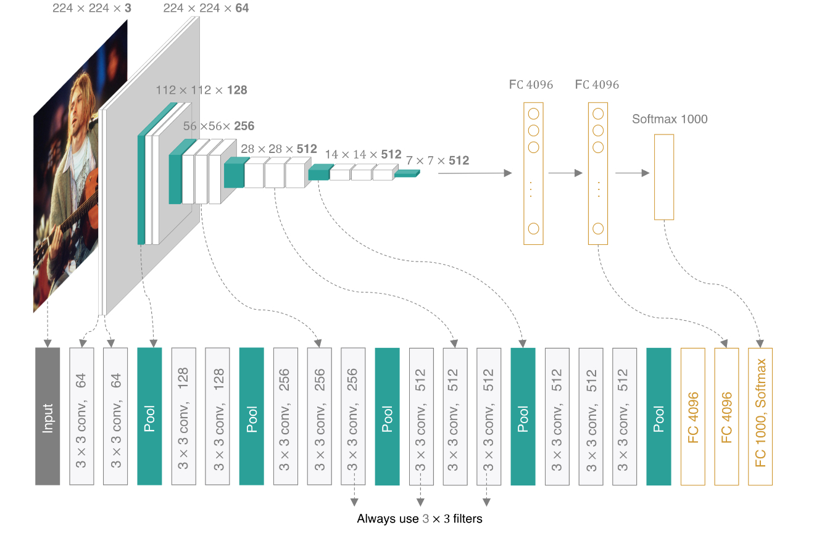

???+ Abstract  

    介绍了神经网络和深度学习的内容，以及几种卷积神经网络模型。
    
    简单介绍了基于ArcGIS Pro的深度学习方法。

## 1. 深度学习

### 1.1 深度学习

1. 介绍
   
    深度学习(DL, Deep Learning)是机器学习(ML, Machine Learning)领域中一个新的研究方向，它被引入机器学习使其更接近于最初的目标——人工智能(AI, Artificial Intelligence)。
   
    利用神经网络来进行运算是深度学习的核心（神经网络构成了深度学习算法的基础），深度学习中的“深度”即指神经网络的层数多。卷积神经网络（CNN）是深度学习的一种类型。

2. 深度学习的应用
   
    智能导航、电子游戏（AlphaGO）、AI翻译、人脸识别、图像识别……

### 1.2 人工神经网络

1. 从人类神经元到人工神经元——MCP神经元
   
    通过电脑编程模拟人类的神经元。MCP神经元（McCulloch–Pitts neuron）是人工神经网络中最基本的结构。对于任何输入数据 $𝑥_𝑖 (1≤𝑖≤𝑛)$，MCP模型可得到1或0这样的输出结果，也就是实现了将输入数据分类到1或0两个类别中，解决了二分类问题。
   
    {.img}

2. （单层）感知机
   
    与MCP模型类似，由一个输入层和一个输出层构成。一种线性二分类模型。
   
    感知机中的连接权重参数并不是预先设定好的，而是通过多次迭代训练得到的。具体而言，单层感知机构建损失函数，来计算模型预测值与数据真实值之间的“误差”，通过最小化损失函数取值，来优化模型参数。
   
    {.img}
   
    上图中的 $𝑥_1, 𝑥_2…𝑥_𝑛$ 为感知机的输入，$b$ 为偏置项（bias）。

3. 前馈神经网络（多层感知机）
   
    在感知机模型中增加若干隐藏层，增强神经网络的非线性表达能力，就会让神经网络具有更强的拟合能力。因此，由多个隐藏层构成的多层感知机被提出，这也被称为前馈神经网络。    
   
    {.img}
   
    如上图所示，前馈神经网络由输入层、输出层和若干隐藏层构成。网络中各个隐藏层中神经元可接收相邻前序隐藏层中**所有**神经元传递而来的信息，经过加工处理后将信息输出给相邻后续隐藏层中**所有**神经元。
   
    前馈神经网络中相邻层所包含的神经元之间通常使用<b id="compConnect">“全连接”</b>方式进行连接。所谓“全连接”是指两个相邻层之间的神经元相互成对连接，但同一层内神经元之间没有连接。前馈神经网络可以模拟复杂非线性函数功能，所模拟函数的复杂性取决于网络隐藏层数目和各层中神经元数目。

4. 激活函数(Activation Function)——实现非线性映射
   
   * 阶跃函数
     
     $$
     h(x) =
\begin{cases}
\begin{aligned}
&0(x\le 0)  \\\
&1(x>0)
\end{aligned}
\end{cases}
     $$
   
   * 
Sigmod函数

     
     $$
     h(x) = \frac{1}{1+e^{-x}}
     $$
   
   * ReLU函数
     
     $$
     h(x) =
\begin{cases}
\begin{aligned}
&0(x\le 0)  \\\
&x(x>0)
\end{aligned}
\end{cases}
     $$
     
     以下是一些激活函数（摘自[维基百科](https://zh.wikipedia.org/wiki/%E6%BF%80%E6%B4%BB%E5%87%BD%E6%95%B0)）
     
     
     
     
单变量输入激活函数

     
     
     
     
多变量输入激活函数

### 1.3 神经网络的参数优化

1. 参数优化过程
   
    神经网络参数优化是一个监督学习的过程。
   
    给定𝑛个标注样本数据 $(𝑥_𝑖,𝑦_𝑖)$，这里 $𝑥_𝑖$ 是输入数据、$𝑦_𝑖$ 是 $𝑥_𝑖$ 的类别等标注信息。假设输入数据 $𝑥_𝑖$ 经过神经网络处理后所得输出预测值为 $ \hat 𝑦_𝑖$，则可通过**损失函数**来计算模型预测值 $\hat 𝑦_𝑖$ 与真实值 $𝑦_𝑖$ 之间误差或损失，利用其来优化模型参数，以便让神经网络按照 $𝑥_𝑖$ 的真实信息 $𝑦_𝑖$ 输出，即让神经网络对数据进行拟合（data fitting）。
   
    具体而言，模型会利用**反向传播算法**将损失函数计算所得误差从输出端出发、由后向前传递给神经网络中每个单元，然后通过**梯度下降**算法对神经网络中参数进行更新。随着迭代的进行，模型预测所得 $\hat 𝑦_𝑖$ 与真实值 $𝑦_𝑖$ 之间的误差逐步缩小，模型预测准确率得以提升，预测的能力得以增强，当迭代达到一定轮次或准确率达到一定水平时，则可认为模型参数已被优化完毕。

2. 损失函数（Loss Function）
   
    损失函数（loss function）又称为代价函数（cost function），用来计算模型预测值与真实值之间的误差。即损失函数量化了当前神经网络的效果有多好。
   
   * 均方误差（Mean Square Error）
     
     $$
     E = \frac{1}{2} \sum_k(y_k - t_k)^2
     $$
   
   * 交叉熵误差（Cross Entropy Error）
     
     $$
     E(y_i, \hat y_i) = -y_i \ log \ \hat y_i
     $$
     
     $$
     E = -\sum_i y_i \ log \ \hat y_i
     $$

3. 梯度下降
   
    梯度下降（gradient descent）算法是机器学习中对模型参数进行优化时所采用的常用方法。为了让模型预测结果与真实结果之间的损失误差最小，利用梯度下降法来逐步迭代优化模型参数。当损失误差最小时，此时学习得到的模型参数即为模型的最优参数。梯度下降是一种使**损失函数最小化**的方法。沿着梯度反方向调整参数可以使损失误差下降最快。

4. 误差反向传播
   
    误差反向传播算法（error back propagation）主要利用损失函数来计算模型预测结果与真实结果之间误差以优化调整模型参数，这一优化调整机制是从输出端向输入端，由后向前递进进行。
   
    损失函数梯度反方向是损失误差下降最快方向。在求取损失函数梯度时需要对各个变量求偏导，这一求取偏导过程要用到**链式法则（chain rule）**。
   
    {.img}   
   
   
链式求导与模型参数更新

???+ quote "Reference"

    [吴飞《人工智能引论》第五章](https://ebook.hep.com.cn/index.html#/detail?id=1146692759717937152&bookType=53)

### 1.4 卷积神经网络

1. 介绍
   
    卷积运算：处理对象从数值对象变成了图像。因此，对于图像这样的数据，不能直接将所构成的像素点向量与前馈神经网络中的每个神经元相连，因为会导致模型的参数量极其巨大，模型难以训练收敛。

2. LeNet
   
    !!! note inline end "LeNet"
   
        LeNet 是一系列网络的合称，包括 Lenet1 - Lenet5，由Yann Lecun等人在论文 [*Gradient-Based Learning Applied to Document Recognitio*](https://ieeexplore.ieee.org/document/726791) 中被提出，是卷积神经网络的 "Hello World"。
   
    LeNet是最早提出的CNN，也是所有CNN模型的基础架构。
   
    LeNet5是一个 7 层的神经网络，包含 2 个**卷积层**，2 个**池化层**，3 个[**全连接层**](#compConnect)。其中所有卷积层的所有卷积核都为 5x5，步长 stride = 1，池化方法都为全局pooling，激活函数为 [Sigmoid](#sigmoid)，网络结构如下：
   
    

3. 卷积
   
    用一个卷积核（滑动窗口）对图像中的像素点进行加权累加。
   
    
   
   
卷积运算的例子

   
   * 填充
     
       位于被卷积图像边缘位置的像素点无法形成一个以其为中心、与卷积核大小一致的图像子块区域，因此无法对边缘位置的像素点进行卷积滤波。为了使边缘位置的图像像素点也参与卷积滤波，填充技术被提出。该方法在边缘像素点周围填充“0”（即0填充）或者其它值，使得可以以边缘像素点为中心形成与卷积核同样大小的图像子块区域。
   
   * 步长
     
     !!! note inline end "卷积结果的分辨率"    
     
        假设被卷积图像大小为 $𝑤×𝑤$、卷积核大小为 $𝐹×𝐹$ 、上下左右四个边缘填充像素行/列数为 $P=⌈𝐹/2⌉$ 、步长为 $𝑆$，则被卷积结果的分辨率是 $\frac{(𝑊−𝐹+2𝑃)}{𝑆}+1 $。 
     
     在进行卷积操作时，通常希望被卷积所得的图像分辨率与卷积前的图像分辨率相比逐渐减少，即图像被约减。  
     
     步长方法通过改变卷积核在被卷积图像中移动步长的大小来跳过一些像素，进行卷积滤波。当stride = 1时，卷积核滑动跳过1个像素，这是最基本的单步滑动，也是标准的卷积模式。
   
   * 池化
     
     1. 最大池化（max pooling）：从输入特征图的某个区域子块中选择值最大的像素点作为最大池化结果。
     
     2. 平均池化（average pooling）：计算区域子块所包含所有像素点的均值，将均值作为平均池化结果。
     
     3. k-max池化（k-max pooling）：对输入特征图区域子块中的像素点取前k个最大值。如从包含4个取值的每一列中选取前2个最大值就得到了2-max池化结果。
        
        

### 1.5 经典的CNN

LeNet, AlexNet, VGG, U-Net, ResNet, DeepLabV3+, …

* [AlexNet](https://proceedings.neurips.cc/paper_files/paper/2012/file/c399862d3b9d6b76c8436e924a68c45b-Paper.pdf)
  
    AlexNet输入为RGB三通道的224 × 224 × 3（或227 × 227 × 3 ）大小的图像。AlexNet整体的网络结构包括：1个输入层（input layer）、5个卷积层（C1、C2、C3、C4、C5）、2个全连接层（FC6、FC7）和1个输出层（output layer）。其中，每个卷积层都包含卷积核、偏置项、ReLU激活函数和局部响应归一化（LRN）模块。第1、2、5个卷积层后面都跟着一个最大池化层，后三个层为全连接层。最终输出层为softmax，将网络输出转化为概率值，用于预测图像的类别。
  
    
  
  
作者为提高效率使用了两块GPU运行，上部分和下部分是对称的

  
    
  
  
输入图像实际大小应该为227 × 227

  
    ???+ Quote "Refrence"
  
        [手撕 CNN 经典网络之 AlexNet（理论篇）](https://zhuanlan.zhihu.com/p/467017218)

* [VGG(Visual Geometry Group)](https://arxiv.org/abs/1409.1556)
  
    相较于AlexNet，使用的都是小卷积核。VGG没有采用AlexNet中比较大的卷积核尺寸（如7x7），而是通过降低卷积核的大小（3x3），增加卷积子层数来达到同样的性能。这样做既减少了参数量，又防止了较大的stride(小卷积核选择的stride也小)导致细节信息的丢失。
  
    
  
    ???+ Quote "Refrence"
  
        [手撕 CNN 经典网络之 VGGNet（理论篇）](https://zhuanlan.zhihu.com/p/473446643)

* [U-Net](https://arxiv.org/abs/1505.04597)
  
    U-Net的网络结构呈U字形，前半部分（左边）作用是进行特征提取（Encoder 编码）并降低空间分辨率，后半部分（右边）是进行上采样（Decoder 解码）恢复到原始输入图像的尺寸。U-Net由收缩路径（contracting path）和扩张路径（expanding path）组成。其中，收缩路径用于获取上下文信息（context），扩张路径用于精确的定位（localization），且两条路径相互对称。
  
    

* [ResNet](https://arxiv.org/abs/1512.03385)
  
    一般来说，网络越深能获取的信息越多，特征越丰富。但现实情况是，随着网络的加深，优化效果反而越差，准确率反而降低了。这是因为网络的加深会造成**梯度爆炸和梯度消失**的问题。ResNet是为了解决这个问题而提出的。

## 2. ArcGIS Pro的深度学习方法

### 2.1 应用场景

* 模板检测，如树、飞机、车、井盖、游泳池;

* 视频检测，识别移动目标，如车、人、船;

* 点云分割，如电力线、电线杆的提取;

* 对象分类，如损坏建筑分类;

* 实例分割，如建筑物提取、3D屋顶结构;

* 语义分割，如土地覆盖提取、建筑物提取、道路检测;

* 边缘检测，如建筑物、耕地、林地边界提取;

* 图像翻译，如制图;

* 变化检测，如城管查违拆违;

* 图像标注，提供图像的文本描述;

* 道路提取;

* ……

???+ quote "Reference"

    [深度学习简介 - ArcGIS Pro](https://pro.arcgis.com/zh-cn/pro-app/latest/help/analysis/deep-learning/what-is-deep-learning-.htm)

### 2.2 ArcGIS Pro中的深度学习模型

???+ quote "Reference"

    [深度学习模型架构 - ArcGIS Pro](https://pro.arcgis.com/zh-cn/pro-app/latest/help/analysis/image-analyst/overview-of-the-deep-learning-models.htm)

### 2.3 精度评价

* TP, FP, TN, FN
  
    TP(True positives):正样本被正确识别为正样本。
  
    TN(True negatives):负样本被正确识别为负样本。
  
    FP(False positives):假的正样本，即负样本被错误识别为正样本。
  
    FN(False negatives):假的负样本，即正样本被错误识别为负样本。

* 准确率（Accuracy）表示分类正确的样本占总样本个数的比例：$Accuracy = \frac{TP+TN}{TP+FP+TN+FN}$ 

* 精准率(查准率，Presicion)： $Precision = \frac{TP}{TP+FP}$

* 召回率(查全率，Recall)：$Recall = \frac{TP}{TP+FN}$

* 真正率(True Positive Rate, TPR, 灵敏度)：$TPR = \frac{正样本预测正确数}{正样本总数} = \frac{TP}{TP+FN}$

* 假正率(False Positive Rate, FPR, 特异度)：$FPR = \frac{负样本预测错误数}{负样本总数} = \frac{FP}{TN+FP}$

* F1 score是精准率和召回率的加权平均：$F_1 = 2 * \frac{Precision * Rcall}{Precision + Recall}$ 

* Kappa系数：$Kappa = \frac{p_o - p_e}{1-p_e} = \frac{2(TP \cdot TN - FN \cdot FP)}{(TP+FP)(FP+TN) + (TP+FN)(FN+TN)}$
  
    其中:
  
    $p_o$: 观察一致性概率（observed agreement probability），是指两个评定者在同一项任务上给出相同评定的实际比例。这是基于实际的评定结果计算出来的，反映了评定者之间的一致性程度。
  
    $$
    p_o = \frac{TP + TN}{TP + FP + FN + TN}
    $$
  
    $p_e$: 期望一致性概率（expected agreement probability），是指在没有任何真实一致性，仅由评定者的随机选择或系统性偏向导致的一致性比例。这是基于评定者各自的评定结果计算出来的，如果评定者的选择是完全随机的，那么$p_e$​将是他们偶然达成一致的概率。
  
    $$
    p_e = \frac{(TP + FP)(TP + FN) + (TN + FN)(TN + FP)}{(TP + FP + FN + TN)^2}
    $$
  
  
  

### 2.4 使用训练好的模型

分类对象、分类像素、检测变化、检测对象。

### 2.5 后处理

非极大值抑制工具、各种数据分析和处理工具。