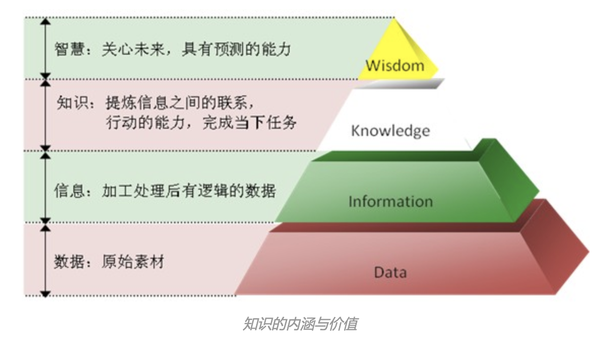
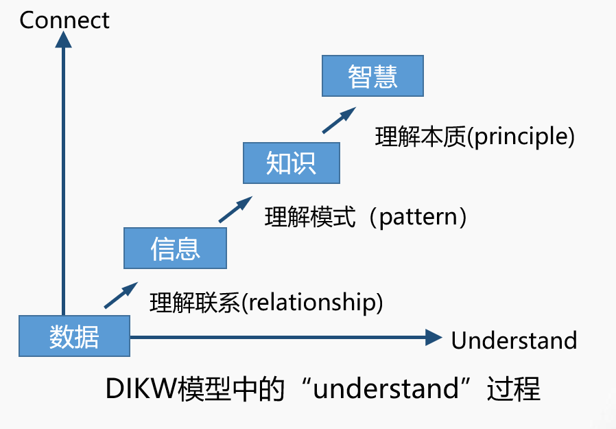

---
hide:
---

???+ Abstract

    这章内容主要是对空间分析的历史、发展、概念、方法、目的等内容的概述，简单介绍了空间分析中PPDAC的流程。

    这章内容以了解为主，主要掌握空间分析的概念，基本知道PPDAC模型的分析流程即可。

## 1. 空间分析概述

### 1.1 著名的空间分析案例

1854年伦敦爆发严重霍乱，当时流行的观点是霍乱是通过空气传播的，而John Snow医生研究发现，霍乱是通过饮用水传播的。原来是由于掏粪工人员不足，粪水流进了泰晤士河，很快泰晤士河就变得污秽不堪。研究过程中，John Snow医生统计分析发现，大多数病例的住所都围绕在Broad Street水泵附近，结合其他证据得出饮用水传播的结论，于是移掉了Broad Street水泵的把手，霍乱最终得到控制。

???+ Quote "Reference"

    [抽水马桶意外引发的血案，3万百姓惨死自己大便之下](http://k.sina.com.cn/article_6217635532_1729996cc001006caf.html?from=history)

### 1.2 GIS的早期历史与一些发展

* 20世纪60年代，随着计算机和计算地理学的出现，地理信息系统(GIS)萌芽。

* 后来，由 Michael Goodchild 领导的国家地理信息和分析中心正式确立了对空间分析和可视化等关键地理信息科学主题的研究。

* Roger Tomlinson 在发起、规划和开发加拿大地理信息系统方面的开创性工作使得 1963 年出现了世界上首个计算机处理 GIS。  
  
    Roger Tomlinson提出了GIS这个名字，他被称为“GIS之父”。

* 1969年，ESRI成立。ESRI开发的许多工具和工具流已成为GIS行业标准。

* 80年代，GIS在环境科学、公共卫生、交通规划等领域得到了广泛应用。同时，GIS软件逐渐变得更加成熟和易于使用，推动了GIS技术的普及。

* 进入21世纪，GIS开始与其他信息技术领域如互联网、移动设备等进行集成，推动了GIS技术的应用范围进一步拓展。同时，GIS在应急管理、军事、电商、智能交通等领域得到了广泛应用。

* 近年来，随着开放式GIS平台的出现，GIS技术的开放性和自由度不断提高。

???+ Quote "Reference"

    [GIS 历史 | GIS 早期历史和未来发展的时间线 ](https://www.esri.com/zh-cn/what-is-gis/history-of-gis)

### 1.3 GIS的现在

* GIS 使人们能够创建自己的数字地图图层，从而帮助解决实际问题。

* GIS 还发展成为一种数据共享和协作的方式，激发了一个愿景，且该愿景正在迅速成为现实：构建一个几乎涵盖所有主题的连续、重叠和可互操作的世界 GIS 数据库。 

* 当今，数十万个组织每天都在分享他们的工作并创建数十亿张地图，讲述故事并揭示所有事物的模式、趋势和关系。

GIS 及空间分析已被广泛应用于测绘、资源调查、灾害监测、交通运输、水利水电、环境保护、空间规划、智慧城市、精准农业和国防建设等各个领域，并已成为人类生活和社会发展不可或缺的基础设施。

???+ Quote "Reference"

    [GIS 历史 | GIS 早期历史和未来发展的时间线 ](https://www.esri.com/zh-cn/what-is-gis/history-of-gis)

### 1.4 GIS的未来

* 随着向 Web 和云计算的转移，以及通过物联网与实时信息的集成，GIS 已成为与几乎所有人类的努力息息相关的平台，成为地球的神经系统。

* 当我们的世界面临人口增长、自然破坏和污染等问题时，GIS 将在我们如何理解和解决这些问题方面发挥越来越重要的作用，并提供使用通用的制图语言交流解决方案的手段。

???+ Quote "Reference"

    [GIS 历史 | GIS 早期历史和未来发展的时间线](https://www.esri.com/zh-cn/what-is-gis/history-of-gis)

## 2. 空间分析概念与方法

#### 2.1 什么是空间分析

* 空间分析是对数据的空间信息、属性性息或者二者共同信息的统计描述或说明。

!!! Info "Cite"

    Spatial analysis is a statistical description or explanation of spatial information, attribute information or common information of data. (Goodchild, 1987)

* 空间分析是对于地理空间现象的定量研究，其常规能力是操纵空间数据使之成为不同的形式，并提取其潜在的信息。

!!! Info "Cite"

    Spatial analysis is a quantitative study of geospatial phenomena. Its conventional ability is to manipulate spatial data into different forms and extract its potential information. (Openshaw, 1997)

* 空间分析是基于地理对象的位置和形态特征的空间数据分析技术，其目的在于提取和传输信息。(郭仁忠院士，1997)

!!! Info "Cite"

    Spatial analysis is a spatial data analysis technology based on the location and morphological characteristics of geographical objects. Its purpose is to extract and transmit information.

* 空间分析是地理学的精髓，是为解答问题而进行的空间数据分析与挖掘。（刘湘南，2017）

!!! Info "Cite"

    Spatial analysis is the essence/core of geography，it aims to spatial data analysis and data mining to solve problems.

#### 2.2 空间分析方法与应用

| Methods                                                                          | Applications                       |
|:--------------------------------------------------------------------------------:|:---------------------------------- |
| Probability theory and model 概率论                                                 | 用于地理现象、地理要素的随机分布研究。                |
| Hypothesis testing and sampling   假设检验与抽样                                    | 用于地理数据的采集和整理。                      |
| Analysis of Correlation 相关分析                                                     | 分析地理要素之间的相关关系。                     |
| Analysis of Variance 方差分析                                                        | 研究地理数据分布的离散程度。                     |
| Analysis of Regression 回归分析                                                      | 用于拟合地理要素之间具体的数量关系、预测发展趋势。          |
| Spatial Patterns 空间模式分析                                                          | 用于分析地理分布模式。                        |
| Time Series analysis 时间序列分析                                                      | 用于地理过程时间序列的预测与控制研究。                |
| Analysis of Principal Components  主成分分析                                      | 用于地理数据的降维处理及地理要素的因素分析与综合评价研究。      |
| Clustering Analysis 聚类分析                                                         | 用于各种地理要素分类、各种地理区域划分。               |
| Covariance and Coefficient of Variation  协方差与变异函数                            | 用于研究地理要素的空间相关性及空间分布的数量规律。          |
| Kriging Method 克里金法                                                              | 用于地理要素分布的空间局部估计与局部插值。              |
| Markov Process 马尔可夫过程                                                            | 用于研究随机地理过程、预测随机地理事件。               |
| Linear\Integer\Dynamic Programming 线性/整数/动态规划  Spatial Optimization 空间优化 | 用于研究有关规划与决策问题,用于有关多阶段地理决策问题的求解。    |
| Analytic Hierarchy Process 层次分析法                                                 | 用于有关多层次、多要素战略决策问题的分析。              |
| Network Analysis 网络分析                                                            | 用于交通网络、通讯网络、河流水系等地理网络的研究。          |
| Input-output Analysis 投入产出分析                                                     | 用于产业部门联系分析、劳动地域构成分析、区域相互作用分析。      |
| Geostatistical Analysis 地统计分析                                                    | 用于空间分布上既有随机性又有结构性或空间相关和依赖性的地理现象的研究 |
| Fuzzy  Mathematics 模糊数学                                                          | 用于各种模糊地理现象、地理过程、地理决策和系统评价研究。       |
| Neural Networks and Artificial Intelligence  神经网络和人工智能                        | 用于有关地理模式的识别、地理过程机制的自学习及预测等。        |
| Cellular Automaton 元胞自动机                                                         | 用于模拟模拟生态、环境、自然灾害等多种高度复杂的地理现象的时空动态  |
| Grey System Theory 灰色系统方法                                                        | 用于灰色地理系统的分析、建模、控制与决策研究。            |
| Fractal Theory 分形理论                                                              | 用于有关地理实体的形态及要素分布形态的自相似机理研究。        |
| Wavelet Analysis 小波分析                                                            | 用于多层次、多尺度、多分辨率的地理时空过程的时频分析。        |
| Genetic Algorithm 遗传算法                                                           | 用于复杂的非线性地理问题的计算。                   |
| Big Data Analysis 大数据分析                                                          | 用于智能交通、孪生城市、智慧农业、社区….              |
| ….                                                                               |                                    |

#### 2.3 空间分析的研究内容

* 空间分析理论
  
    主要是指空间概念、空间描述方法、空间特征等基本理论问题，同时也包括基于空间思维的解决问题的方法论。

* 空间分析方法
  
    主要是指在空间分析理论的指导下，针对空间特征、面向空间问题，建立分析模拟模型，开发分析工具。

* 空间分析应用
  
    主要研究如何应用空间分析的理论和方法解决实际问题，重点是如何将复杂具体的现实问题抽象为空间问题，搭建模型、方法与应用之间的桥梁。

#### 2.4 空间分析的目的

* 认知(Cognition)
  
    有效获取空间数据、并对其进行科学的组织描述，利用数据再现事物本身，如绘制[风险图](https://learn.arcgis.com/zh-cn/projects/analyze-covid-19-risk-using-arcgis-pro/)。

* 解释(Explanation)
  
    理解和揭示地理空间数据的背景过程，认识事件的本质规律，如[住房价格中的地理邻居效应](https://urban.pkusz.edu.cn/info/1007/3136.htm)。

* 预报(Forecast)
  
    在认识、掌握事件发生现状与规律的前提下，运用有关预测模型对未来的状况做出预测，如[传染病的爆发](https://www.dqxxkx.cn/article/2021/1560-8999/1560-8999-23-11-1924.shtml)。

* 调控和决策(Regulation and Dcision-making)
  
    对地理空间发生的事件进行调控，如[合理分配资源](http://xbna.pku.edu.cn/fileup/0479-8023/HTML/2021-6-1143.html)。
  
    根据空间分析的结果进行决策，如[规划和优化交通路线](https://www.esri.com/zh-cn/industries/transit/business-areas/route-planning-optimization)。 

#### 2.5  DIKW模型

DIKW金字塔很好地描述了人类认识世界的规律和层次结构，分别是：

!!! Note inline end

    - Information用于认知、解释目标
    - 预报用knowledge
    - 调控需要用到wisdom

- 数据（Data原始的事实集合）

- 信息（Information可被分析测量的结构化数据）

- 知识（Knowledge需要洞察力和理解力进行学习）

- 智慧（Wisdom推断未来发生的相关性，指导行动）

DIKW金字塔模型表达了数据通过分析、理解逐步升华为信息、知识乃至智慧的过程。

在DIKW模型中，通过数据分析，即在一定思想指导下形成各种数据分析方法与模型，进行“理解”，实现数据-信息-知识-智慧的升华。

GIS空间分析 重点聚焦在学习`数据→信息`与`信息→知识`的一些方法。

???+ Quote "Reference"

    [DIKW：数据、信息、知识、智慧的金字塔层次体系](https://www.jianshu.com/p/933d930f4482)

## 3. PPDAC模型

由于空间分析具有区别于其他普通分析的特殊性，在空间分析过程中运用PPDAC模型时，更关注的是具有明确空间背景的问题，即关注空间关系和空间依赖性、时空关系、空间分析中不满足经典统计准则的现象、空间过程与格局之间的关系、空间数据源及其质量等相关的问题。

!!! tip  "空间分析的特殊性"

    空间分析具有区别于其他非空间数据分析的特殊性，如
    
    - 通常一个位置的数据并**不独立于**其他位置的数据，尤其在彼此靠近的地点进行测量分析时，这种关联（空间相关性）是常态。
    
    - 许多问题还必须在**时空背景**下考虑。
    
    - 空间模式**很少**由**单个过程唯一决定**的，因此空间分析通常是进一步研究过程和模型构建的**开始**，而很少是研究的结束。

#### 3.1 Problem: 提出问题（Framing the question）

确定要研究的问题往往是整个过程的重要组成部分。将问题分解为关键组成部分（components），并将问题简化为关注其基本的、最重要的和相关的子部分，常常是很有效的第一步。

!!! question "Problem 阶段可能需要考虑的问题"

    - 空间尺度因素（spatial scale factors）：将在哪个研究区域开展工作，改变这一点对一些或所有数据集有什么影响？相同的比例因素适用于所有感兴趣的数据吗？
    - 统计尺度因素（statistical scale factors）：要分析和报告的数据在什么级别上进行分组？
    - 空间布局因素（spatial arrangement factors）：研究区域的空间布局或分区的重新布局是否会对分析产生影响?
    - 问题制定是否需要在可用的时间、预算和资源范围内提供类型、大小或质量标准的数据？
    - 所寻求的关于空间分组数据的结论是否意味着分组（例如，在县一级，在农场一级）真正代表了组中的所有组成部分（例如，居住在县内的个人，农场内的田地）？如果是这样的话，分组区域必须完全或基本上是同质的，以避免所谓的生态谬误（ecological fallacy）——在只知道整体群体特征的情况下，将特征归因于群体成员。
    - 是否根据采样个体的测量特征寻求有关空间分组数据的结论？如果是这样的话，样本必须完全或高度代表群体，以避免所谓的原子论谬误（atomistic fallacy）——基于潜在的不具代表性的成员样本将特征归因于群体的成员。

#### 3.2 Plan: 制定方法（Formulating the approach）

在就问题定义达成一致后，下一阶段是制定一种方法，尽最大可能解决问题并获得符合预期的答案（结果）。

!!! question "Plan 阶段可能需要考虑的因素"

    - 问题和项目的性质——是纯粹的调查，还是正式的研究活动；本质上是**描述性的**（对结构和关系的识别），还是**更关心过程**（在过程中可能需要更清楚地理解原因和影响，特别是如果要开发预测模型和/或预期将规定措施作为输出？）
    - 是否需要商业成本计算和/或成本效益分析？
    - 是否需要特定的决策支持工具和程序？
    - 所涉及的公众参与程度和公众意识（如果有的话）是多少？
    - 与演习相关的具体作战需求和条件是什么？
    - 可以在什么时间进行研究，是否有任何关键的（最终或中间）截止日期？
    - 有哪些资金和其他资源可用？
    - 该项目在技术上是否可行，存在什么可评估的失败风险，以及问题复杂性如何影响这一风险？
    - 客户（商业、政府、学术研究）的期望是什么？
    - 是否有必须使用的规范、标准、质量参数和/或程序（例如，遵守国家规范）？
    - 该研究与其他关于相同或类似问题的研究有何关联？
    - 需要哪些数据组件，以及如何获得这些组件（现有来源、收集的数据集）？
    - 要研究的数据（单位）是从目标人群中选择的，还是样本在某种程度上是不同的，并随后应用于人群（在这种情况下，不仅必须考虑采样误差，还必须考虑所谓的研究误差）？

地理空间分析中，罕见事件、空间异常值、极值、异常群集等异常现象对研究的影响是极其重要的。探索性方法，比如绘制和检查病例以及绘制方框图，有助于确定这些观察结果是否有效和重要，或是否需要从研究集中删除。

#### 3.3 Data: 数据采集（Data acquisition）

在实际中，并非所有所需数据集都具有相同的质量、成本、许可安排、可用性、完整性、格式、及时性和细节。在大多数情况下我们都必须做出妥协，因为最重要的准则是满足我们的目的。

从定义上讲，几乎没有一个数据集是完美的。所有数据集都可能包含误差、缺失值、具有有限分辨率、包括以离散数学形式建模真实世界所导致的失真、包含测量误差和不确定性，并且可能表现出对位置和/或属性数据的有意或设计的调整（例如，出于隐私原因，作为聚合过程的一部分）。空间分析工具可能包含也可能不包含明确处理这些因素中一些更明显因素的设施。

#### 3.4 Analysis: 分析方法和工具（Analytical methods and tools）

???+ note inline end

    空间分析中一个反复出现的主题是**模式（pattern）**的概念。分析的目的通常被描述为**识别和描述空间模式，从而试图理解和建模产生观察到的模式的过程**。

在分析阶段之前就应对方法和工具进行初步选择。简单（Simplicity）和节俭（parsimony），使用最简单、最清晰的工具、模型和可视化形式，以及适合问题和目标应该是关键标准。其他因素包括：适当工具的可用性；时间和成本限制；需要提供有效性和稳健性检查，可以通过对一致性、敏感性和质量进行内部和/或外部检查；符合相关标准；多种技术的使用；以及使用独立的和/或附加的数据集或采样。

#### 3.5 Conclusions: 公布结果（Delivering the results）

PPDAC过程的最后阶段是根据所进行的分析得出结论，并将这些结论传达给其他人。   

???+ Quote "Reference"

    [Geospatial Analysis 6th Edition, 2021 update - de Smith, Goodchild, etc](https://spatialanalysisonline.com/HTML/index.html?analytical_methodologies.htm)
    
    [PPDAC模型 - 知乎 ](https://zhuanlan.zhihu.com/p/625077998)

## 4. 学习参考资料

* GIS空间分析(科学出版社)， 刘湘南等

* [Geospatial Analysis 6th Edition](https://spatialanalysisonline.com/HTML/index.html)

* 微信公众号：[虾神说D](https://mp.weixin.qq.com/mp/appmsgalbum?__biz=MzA4ODk4NzgyNA==&action=getalbum&album_id=1349424235982290944#wechat_redirect) (强烈推荐大家读一读)

* [Statistical Methods for Geography](https://study.sagepub.com/rogerson5e)

* [空间数据分析-MOOC](http://mooc1.mooc.whu.edu.cn/course/206844583.html)
