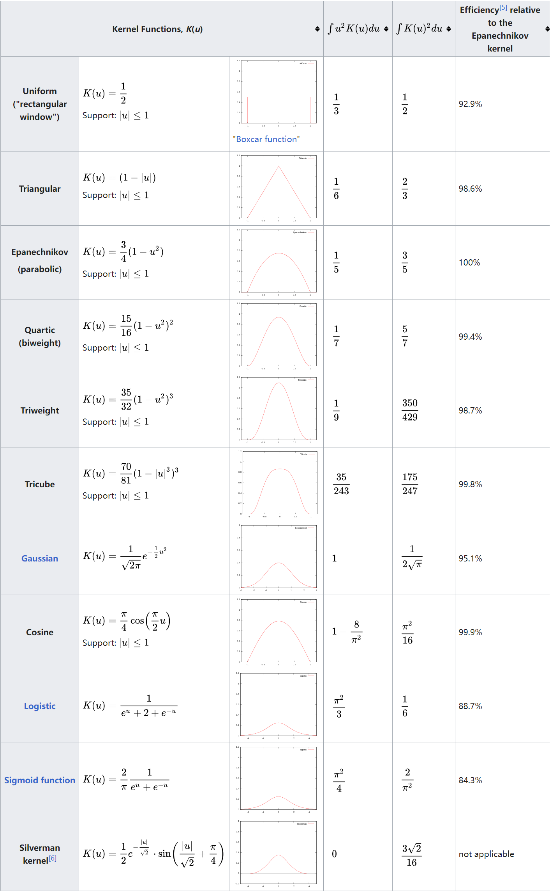

???+ Abstract
    介绍了空间模式分析的概念，空间分布类型，详细介绍了几个点模式分析方法。
    
    空间模式和空间模式分析的概念，空间分布类型，点模式分析方法。

## 1 空间模式分析介绍

### 1.1 空间模式

**空间模式**（或空间分布模式）一般指人或物在现实世界中的组织或位置。

它可以表示人、物之间距离的远近，或者它们之间呈现的绝对或相对位置规律。

### 1.2 空间模式分析
**空间模式分析**提供了关于事物发生的地点、事件的分布或数据的排列如何与场景中其他特征对齐，以及这些模式可能揭示的潜在联系和相关性的见解。

空间模式分析包括识别、描述和测量地理数据中的形状、排列、位置、配置、趋势或关系。

空间模式分析通常考虑两个概念: 空间对象和分布区域。分布区域指空间对象所占据的空间域。  

* 空间对象有点型、线型、面型  
* 分布区域有线型和面型  
* 空间分布有离散型和连续型  

## 2 空间分布/模式
!!! note inline end
    这里的`面`、 `多边形`具有相同的含义，都是指`polygon`。

7种基本的空间分布类型：

1. 线要素上的离散点  
2. 线要素上的连续分布  
3. 面要素上的离散点  
4. 线性分布  
5. 多边形的离散分布  
6. 多边形的连续分布
7. 空间连续分布

由于点要素分布占空间分布的绝大部分(95%)，线要素和面要素的分布只占极小的比例，因此我们将主要研究点要素的空间分布模式。

**点分布模式**：

* 离散型  
* 随机分布(均匀分布)  
* 聚集型  

## 3 点模式分析
### 3.1 样方分析 

比较空间采样区域（样方）内的对象的统计预期和实际计数，以测试诸如随机性和聚类等分布模式。
!!! example "样方分析的例子"
    在一个具有5×6个小方格的矩形内，随机扔下30个点，对每个方格按如下规则进行记分：
    > 方格内含有0,1,2,3,4,5,6,7(及以上)的分别记1,0,1,4,9,16,25,36分  
    将所有方格的得分加起来，得到结果score。
    有如下分析： 
    
    * 经过大量实验后得到的score的平均值为29;
    * 95%的情况下，score在17到45之间；
    * 如果score $\leq$ 16, 得到的点模式更加均匀/分散/规则。
    * 如果score在17到45之间，得到的点模式比较随机。
    * 如果score $\geq$ 46, 得到的点模式显著聚集。
* 样方法的特点:  
    - 简单  
    - 样方分析的一个重要议题是样方大小的确定：  
    > 单元格太小，将有太多空单元格，最小的空间尺度之外的尺度上可能存在的聚类将被忽略。  
    > 单元格太大，单元格内的的空间模式可能被忽略。  
    - 在某些空间尺度上可能找到空间模式，但在其他空间尺度上却找不到，因此样方的大小十分重要。(有建议平均每个样方2个点的，也有建议平均每个样方1.6个点的)  
*  **方差均值比(variance-mean ratio, VMR)**:  
    平均值 $\bar x$ 等于总点数除以总格子数m;  
    方差为:  
    $$
    s^2 = \frac{\sum_{i=0}^{m}(x_i-\bar x)^2}{m-1}
    $$
   最后计算方差均值比 VMR = $ {\bar x}/{s^2} $    
    **VMR结果分析**： 
        
    * 如果VMR < 1，则点数的方差小于平均值。在比率趋近于零的极端情况下，每个单元格之间的点数变化很小。这种情况下点是离散分布的。
    * 如果VMR > 1，则每个单元格的点数有很大的变化, 有些单元格的点数比预期的要多得多，有些单元格的点数比预期的要少得多，点聚集分布。
    * 当VMR值接近于1时，表明这些点接近于随机分布在整个研究区域。

* 空间统计中的**零假设**$H_0$：  
  在空间统计中，零假设指的就是空间位置在一定区域里面呈现完全随机（均匀）分布。
  > 在自然现象里面，均匀分布是极小概率才会出现的，基本上都可以忽略了，所以一般谈的就是完全随机。  
  >  推荐阅读: [空间统计中的零假设](https://mp.weixin.qq.com/s?__biz=MzA4ODk4NzgyNA==&mid=2649736542&idx=1&sn=4f24c1143b99bd2a750bfeafe38ece8a&chksm=883aa481bf4d2d97255d1416ed0cb376b7076f1f915eda804ab38b612ae3433ad95ca9d99ead&scene=178&cur_album_id=1349424235982290944#rd)

  * 包含VMR的$\chi^{2}$**检验**：  
    $$
    \chi^2 = \frac{(m-1)s^2}{\bar x} = (m-1)VMR
    $$
    如果 $\chi^2<\chi_L^2$ 或者 $\chi^2>\chi_H^2$, 拒绝零假设，说明研究对象的空间模式不是随机的。  
    当自由度较大时(大于30), 可以将$\chi^{2}$分布近似为正态分布处理。

  * 正态分布中的P值(P-value)与z分数(z-score):  
    在ArcGIS Pro的工具生成报告中，可以看到P值和z分数总是成对出现的。  

    **P值越小、z分数的绝对值越大，表示拒绝原假设的把握越大**，也即空间模式为非随机的概率越大。  

    z分数越小，表示空间模式越趋向离散；z分数越大，表示空间模式越趋向聚集。(注意，这只是对上面所举的例子而言的，在其他分析中，可能z分数越大表示越离散)。

    !!! Tip

        * $z_L=-1.65, z_H=1.65$ 时，如果|z| > 1.65 (P < 0.1), 表示有90%的把握拒绝原假设。
        * $z_L=-1.96, z_H=1.96$ 时，如果|z| > 1.96 (P < 0.05), 表示有95%的把握拒绝原假设。
        * $z_L=-2.58, z_H=2.58$ 时，如果|z| > 2.58 (P < 0.01), 表示有99%的把握拒绝原假设。
        * $z_L=-3.31, z_H=3.31$ 时，如果|z| > 3.31 (P < 0.001), 表示有99.9%的把握拒绝原假设。

### 3.2 点密度  

???+ note inline end "ArcGIS Pro中的填充字段"  
    ArcGIS Pro的点密度分析工具中有一个填充字段(Population Field)参数，默认情况下为`None`，可以看成每个点的值都为1。

    当设置填充字段参数时，可以认为是为每个点赋上了一个权重。

在每个输出栅格单元周围定义一个领域，计算落在领域内点的数目，再将点数目除以邻域面积，即为该栅格单元的**点密度**。

点密度中的**半径(Radius)**:   

* 在某种程度上，半径可以视为**空间尺度**。  
* 增大半径不会使得计算的点密度结果大大增加，这是因为在增大半径的使邻域内点数目增多的同时，邻域面积也在变大。

!!! tip "四种空间尺度类型"
    1. 制图尺度或者地图尺度(carlographic or map scale)  
       通常就是指地图制图时候的比例尺。
    2. 测量尺度或者分辨率（measurement scale or resolution）  
      指的是空间数据集中最小的可区分部分，比如遥感影像中的像素大小。
    3. 观测尺度或者地理尺度（observational or geographic scale）  
       主要指的是空间分析中，研究区域的空间扩展，是一个相对的概念。  
       在点密度分析中，选择不同的半径大小，就可以认为是选择了不同的空间尺度。
    4. 运行尺度或者操作尺度（operationl scale）  
       指的是地学现象发生的空间环境以及范围。
    ---
    推荐阅读:    

    * [空间尺度研究之测量尺度与分辨率](https://mp.weixin.qq.com/s?__biz=MzA4ODk4NzgyNA==&mid=2649738107&idx=1&sn=736b4e4e7736551cbba2c16b76bb1da3&chksm=883aaaa4bf4d23b2de7fca967fae09dc4f5e83cee5d0fdc1043e6ffc08b37623b5001bb960ed&scene=178&cur_album_id=1349424235982290944#rd)   
    * [空间尺度研究之观测尺度、地理尺度](https://mp.weixin.qq.com/s?__biz=MzA4ODk4NzgyNA==&mid=2649738177&idx=1&sn=f7fd2f4960cd80f581ef71160e842c12&chksm=883aaa1ebf4d23088e322add9e4745ce969bbc026c11e4312a7a41db9b363aee030d5d4096b7&scene=178&cur_album_id=1349424235982290944#rd)    
    * [空间尺度研究之运行尺度](https://mp.weixin.qq.com/s?__biz=MzA4ODk4NzgyNA==&mid=2649738337&idx=1&sn=1f8ec572af5fb6742542fc514d047c4d&chksm=883aadbebf4d24a81ba2edae18fa86e47f4bc1e2810553dcaa0bdd7cb405c5b7edb09199e0e7&scene=178&cur_album_id=1349424235982290944#rd)   
    
缺点：密度值从一个值到另外一个值存在突然变化的可能，即结果不够平滑。 

### 3.3 核密度  

**基本思想**: 核密度分析使用核函数计算点、线要素测量值在指定邻域范围内的单位密度。 

* 简单来说，它能直观的反映出离散测量值在连续区域内的分布情况。  
* 其结果是中间值大周边值小的光滑曲面，栅格值即为单位密度，在邻域边界处降为0。 
* 核密度分析与点密度分析类似，不同的是核密度分析计算点密度时用到了**核函数**，这样能使结果表面更加平滑。

!!! tip "理解核密度分析"
    概念上，**每个点**上方均覆盖着一个平滑曲面，在点所在位置处表面值最高，**随着与点的距离的增大表面值逐渐减小**，在与点的距离等于搜索半径的位置处表面值为零。需要注意，这个邻域只能是一个圆形邻域。这里有几点需要注意：   

    1. 核密度关注的是每个点，在核密度分析中，会对`每个点`定义一个邻域，再在邻域中计算该点的密度函数。这与点密度分析不同，点密度分析关注的是栅格，是通过对`每个栅格`单元定义邻域计算点密度的。  
    2. 核密度分析的一个关键是**核函数**，事实上，核函数的作用就是实现 `“随着与点的距离的增大表面值逐渐减小”` 。
    3. 由于每个点都会在平面上形成一个核表面，因此最后的结果中，每个输出栅格像元的密度就是叠加在栅格像元中心的所有核表面的值之和。如果有需要可以对结果进行归一化处理 (如：除以n `点的数目，也即所有核表面的数目`)。
    4. 从结果来看，核密度分析结果包含了一些预测和趋势，而之前的点密度分析结果就是纯密度。
    ---
    参考：[核密度分析的工作原理](https://pro.arcgis.com/zh-cn/pro-app/latest/tool-reference/spatial-analyst/how-kernel-density-works.htm)

    推荐阅读：

    * [核函数：密度图跳变的解决方法](https://mp.weixin.qq.com/s?__biz=MzA4ODk4NzgyNA==&mid=2649737930&idx=1&sn=5a9a4f1d3a53ed5da495a8bac9333de9&chksm=883aab15bf4d2203e8358c525fc0906bfe52ce45a0b2e9cfbbfa3cb1f0898084eaf8c51b8770&cur_album_id=1349424235982290944&scene=189#wechat_redirect)  
    * [二维平面核函数的计算以及关键参数意义](https://mp.weixin.qq.com/s?__biz=MzA4ODk4NzgyNA==&mid=2649738042&idx=1&sn=3e214a401b0fe52572b1b63352dfef6c&chksm=883aaae5bf4d23f35b3941a3f85310dca1d188d7e00f6093fe291e9fa85a643b6c81c98c71fa&cur_album_id=1349424235982290944&scene=189#wechat_redirect)

!!! note inline end
    在这部分中，邻域的`半径`，`搜索半径`，`带宽(band width)`是同一概念。  
        
核密度分析的主要内容：对研究区域内的每个点s，定义一半径为r的圆形区域(邻域)，落在该邻域的所有点的集合为 $ S=s_1,s_2,…s_n $ ，需要分析的是点s的分布密度函数f(s):
$$
f(s) = \frac{1}{n} \sum_{i=1}^{n} K_\tau (s-s_i) = \frac{1}{n\tau} \sum_{i=1}^{n} K_\tau (\frac{s-s_i}{\tau})
$$
其中$K(x)$就是核函数，$\tau$表示带宽(band width), $s-s_i$ 可理解为中心点到每个点距离。

**常用的核函数** (图源 [维基百科-Kernel](https://en.wikipedia.org/wiki/Kernel_(statistics))):

从这些核函数可以看到，当函数输入的绝对值比较小(表示某个点到邻域中心点的距离小)时，会输出更大的值，也即`随着与中心点的距离的增大表面值逐渐减小`。

### 3.4 平均最近邻分析  

**平均最近邻分析**是比较`样本`中每个点与最近邻要素之间的**观测平均距离**和`随机分布`中每个点与的最近邻要素之间的**预期平均距离**(零假设)的方法。

计算公式:  
$$ 
R = \frac{R_0}{R_e} = \frac{\bar x}{1/(2{\sqrt\lambda})} = \frac{\bar x}{1/(2{\sqrt {n/A}})} = 2\bar x \sqrt{n/A}
$$
其中$R_0$ 和$R_e$ 分别是观测值与期望值；$\bar x$ 是所有点到最近点距离的平均值；$\lambda$ 为点密度；$A$ 为研究区域面积。
!!! tip "对R的分析"  
    * R的范围为0(所有点在同一位置)到2.14(无限平面均匀分布)
    * R = 1 时表示随机分布
    * $V_R = \frac{4-\pi}{\pi n}$  
    * $z=\frac{R-1}{\sqrt{V_R}}$ 服从标准正态分布

需要注意的是，观测尺度(即所选研究区域的大小)对平均最近邻分析法的结果影响很大。
    

### 3.5 多距离空间聚类分析(Ripley's K函数)

计算步骤： 

1. 对研究区域内的每个点构建一个半径为r的圆；
2. 计算落在圆内的点数目(不包含自身)； 如果有权重，则计算加权值；
3. 对每个圆计算出来的点数目求和，计算平均值；
4. 将得到的平均值除以点密度；
5. 使用不同的半径重复上述过程。

计算公式: 
$$
K(r) = \frac{\sum_i^n \sum_j^n k_{i, j}} {\lambda n} = \frac{A}{n^2} {\sum_i^n \sum_j^n k_{i, j}}
$$
    其中，r是圆的半径，n是点的总数目，A是研究区域面积，k是权重。当i，j距离小于r时，k=1，否则k=0。如果有边校正等措施，权重会略有变化。

!!! tip "对K(r)结果的分析"
    在完全空间随机的情况下，$K(r) = \pi d^2$，则：
    
    * $K(r) = \pi d^2$ 时，点在尺度r下随机分布；
    * $K(r) < \pi d^2$ 时，点在尺度r下离散分布；
    * $K(r) > \pi d^2$ 时，点在尺度r下聚集分布；
    --- 
    * 如果特定距离下的 K 观测值大于 K 期望值 ，则该分布比相同距离下（分析尺度）的随机分布聚类程度更高；
    * 如果 K 观测值小于 K 期望值 ，则该分布比相同距离下的随机分布离散程度更高。
    * 如果 K 观测值大于置信区间上限值，则该距离的空间`聚类`具有统计显著性；
    * 如果 K 观测值小于置信区间下限值，则该距离的空间`离散`具有统计显著性。

推荐使用 Ripley's 原始 K 函数的多种变体，在ArcGIS Pro中使用的便是其中一种常见的变换。  
具体可见：[多距离空间聚类分析（Ripley's K 函数）的工作原理](https://desktop.arcgis.com/zh-cn/arcmap/latest/tools/spatial-statistics-toolbox/h-how-multi-distance-spatial-cluster-analysis-ripl.htm)
