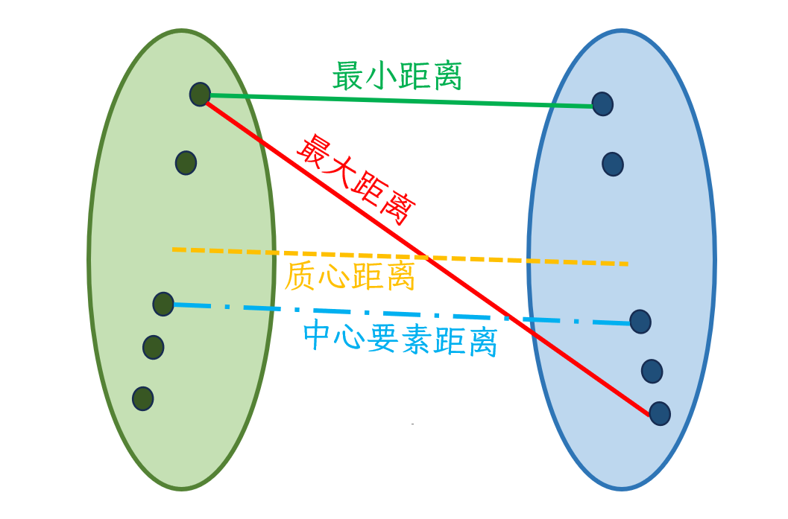
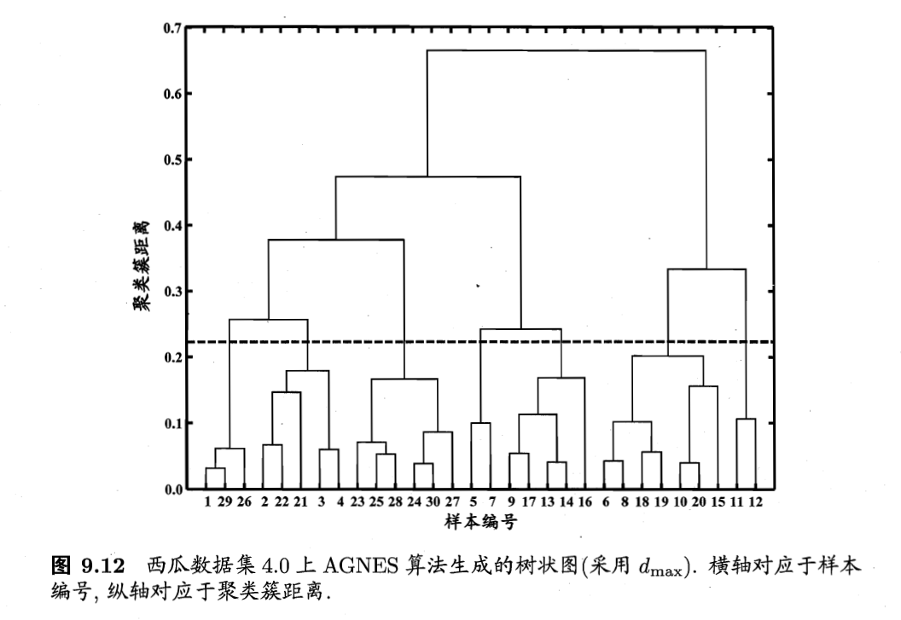
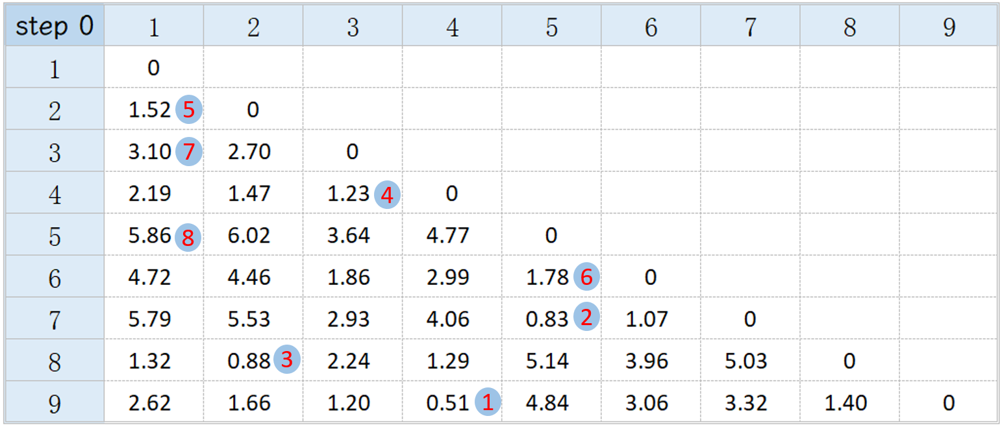
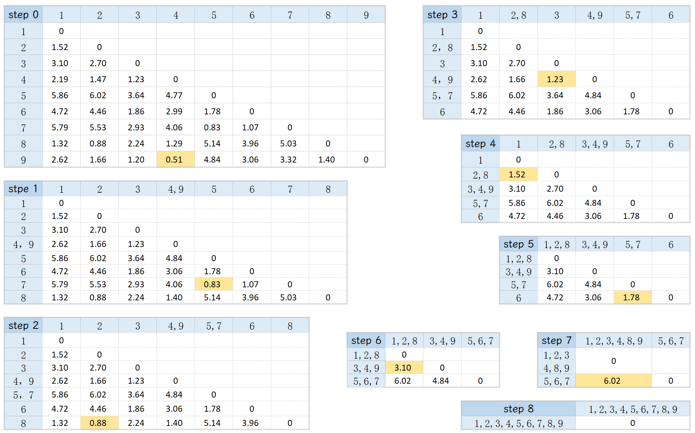
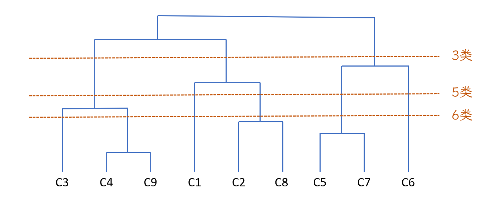

???+ Abstract
    
    介绍了聚类分析和聚类的相似性度量方法，重点介绍了几种空间聚类算法。

    熟知k-means算法、AGNES算法、modified AGNES算法的原理，能够基于相异度矩阵使用AGNES和modified AGNES算法进行聚类。
    

## 1. 聚类分析

* 聚类 (Cluster)
  
    数据对象的集合称为聚类。
  
    > 同一聚类内的对象相似  
    > 不同聚类间的对象不相似

* 聚类分析(Clustering analysis, Clustering)
  
    根据数据中的特征发现数据之间的相似性，并将相似的数据对象分组到同一类别中去。

* 聚类分析的应用
  
    1. 模式识别；  
    
    2. 空间数据分析；
       
        > GIS中通过对特征空间进行聚类创建专题图；  
        > 图像处理，如土地利用类型识别。
    
    3. 经济科学，尤其是市场研究；
    
    4. 万维网文档分类；
     
        ……

## 2. 聚类相似性的衡量

### 2.1 什么是好的聚类

* 聚类质量的评价标准 

    **类内相似度高，类间相似度低**。（Fisher判别准则）  
    
* 聚类质量的影响因素

    1. 聚类结果的质量取决于所使用的相似性度量策略以及方法的实现。    
    2. 聚类策略的质量也受其发现隐藏模式的能力的影响。

* 两种衡量聚类相似度（similarity of clustering）的策略：

    1. 基于距离的策略策略  
    2. 基于相似系数的策略

### 2.2 基于距离的策略

!!! note inline end
    距离函数的定义通常与区间尺度(interval-scaled)、布尔(boolean)、分类(categorical)、序数(ordinal)、比值(ratio)
    向量(vector)等变量非常不同。

聚类的相似度可以用距离函数表示，即 $d(i, j)$。

根据应用和数据语义，应该将权重与不同的变量关联起来。这意味着对于不同的应用和数据含义，我们需要对变量赋予不同的权重，以便更准确地反映它们在相似性或差异性计算中的重要性。

很难定义“足够相似”、“足够好”，即相似性的阈值常常没有清晰的界定阈值，界定是非常主观的，并且会根据个人观点、特定问题领域和所分析数据的性质而有所不同。

!!! tip "一些常见的衡量不同聚类间相似性(不相似性)的距离"
    
    * 闵可夫斯基距离
    $$
    d(i, j) = \sqrt[q]{(|x_{i1} - x_{j1}|^q + |x_{i2} - x_{j2}|^q + … + |x_{ip} - x_{jp}|^q)}
    $$
    其中 $(x_{i1}, x_{i2}, … , x_{ip})$ 和 $(x_{j1}, x_{j2}, … , x_{jp})$ 是两个点的坐标（p是维度）。   

    * 曼哈顿距离 (闵可夫斯基距离中$q = 1$) 
    $$
    d(i, j) = |x_{i1} - x_{j1}| + |x_{i2} - x_{j2}| + … + |x_{ip} - x_{jp}|
    $$

    * 欧式距离 (闵可夫斯基距离中$q = 2$) 
    $$
    d(i, j) = \sqrt{(|x_{i1} - x_{j1}|^2 + |x_{i2} - x_{j2}|^2 + … + |x_{ip} - x_{jp}|^2)}
    $$

    * 切比雪夫距离 (闵可夫斯基距离中$q \rightarrow \infty$)
    $$
    d(i, j) = max(|x_{i1} - x_{j1}|, |x_{i2} - x_{j2}|, … , |x_{ip} - x_{jp}|)
    $$

由于我们能算出来的只是聚类单个点之间的距离，我们需要知道聚类整体之间的距离，需要使用一些替代量来表示，常见的有：**最小距离、最大距离、平均距离、质心距离、中心要素距离**等。

!!! tip inline end "质心(Centriod)与中心(Medoid)"
    
    质心(Centriod)是所有样本点的均值，通常它不是任何一个样本点。

    中心(Medoid), 或者说中心要素，是样本点中到其他样本点距离最小的那个点，是样本点之一。(类似中位数)

* 最小距离：两个聚类中所有元素间的最小距离；

* 最大距离：两个聚类中所有元素间的最大距离；

* 平均距离：两个聚类中所有元素间距离的均值；

* 质心距离：两个聚类的质心间的距离；

* 中心要素距离：两个聚类的中心要素间的距离。

{.img}

### 2.3 基于相似系数的策略

夹角余弦和[相关系数](../6_SpaCorr#1)是两类常用的相似系数。这里介绍一下**夹角余弦**（Angle Consine）：

假设样本点的个数为m，维度为n，则第i个样本 $\bm x_i$ 和第j个样本 $\bm x_j$ 之间的夹角余弦值为：  
$$
    cos(\theta_{ij}) =  \frac{\bm x_i \cdot \bm x_j}{|\bm x_i| |\bm x_j|} = \frac{\sum_{k=1}^n x_{ik}x_{jk}}{\sqrt{\sum_{k=1}^n x_{ik}^2} \cdot \sqrt{\sum_{k=1}^n x_{jk}^2}}
$$
两个样本之间的夹角余弦越大（越接近1），它们就越相似。

## 3. 空间聚类分析方法

### 3.1 基于划分的聚类

将数据集的n个对象划分到k个聚类当中去，使得所有类的距离平方和最小：
$$
\sum_{m=1}^{k} \sum_{i=1}^{n_m} (C_m - t_{mi})^2
$$
其中 $C_m$ 是聚类m的中心，$n_m$是第m个聚类的样本数。

全局最优的算法是详尽得枚举所有划分方法，但这几乎不可能实现。常用的算法是k-means算法、k-medoids算法，不过它们并不能保证找到全局最优解。

* **k-means聚类算法**

    **步骤**： 

    1. 选取n个种子点作为初始聚类中心；    
    2. 计算其他所有点到每个聚类中心的距离，将每个点加入到离它最近的聚类中心所代表的类中去；  
    3. 重新计算聚类中心（平均中心、质心）；  
    4. 重复2、3步，直到达到某个终止条件（如迭代次数、中心变化阈值）。

    **优点**：简单；计算效率相对较高；可扩展性强。

    **缺点**：  

    1. 需要指定类别数k；  
    2. 无法发现噪声和异常值；  
    3. 对初始质心敏感：算法的结果受到初始质心选择的影响，可能导致局部最优解；  
    4. 对簇形状和大小敏感: K-means算法假设簇是凸的、大小相似的，对于其他形状和大小的簇可能效果不佳。

* **k-medoids聚类算法**

    与k-means几乎相同，差异在于k-medoids算法将中心要素(聚类中最靠近中心的样本)作为聚类中心，这样做能降低极端异常值对结果的影响，因为中位数对极值不敏感。

* **ISOData(Interactive Selforganizing Data Analysis Techniques Algorithm)**
    
    ISOdata （迭代自组织数据分析技术），基于k-means算法进行了改进，主要加入了`合并(merging)`和`分解(splitting)`两个操作。

    * 合并

        当两个聚类(中心/类)之间的距离小于给定阈值时，这两个簇/类被合并为一个。

        当某一聚类的样本数量超过给定阈值时，该类被合并到相邻的类中。

    * 分解

        当某一聚类的标准差大于给定阈值，或者其样本数量超过给定阈值时，该类被分为两个。

### 3.2 基于层次的聚类

使用距离矩阵作为聚类标准。该方法不需要输入聚类的数量，但需要一个终止条件。分为聚合层次分类(如AGNES)和分类层次分类(如DIANA)。

* **AGNES(AGglomerative NESting)**

    一种采用自底向上聚合策略的层次聚类算法。

    **步骤**：
        
    1. 将所有单个样本（单个对象）都视为一个类；  
    2. 使用最小距离策略和[相异度矩阵](https://baike.baidu.com/item/%E7%9B%B8%E5%BC%82%E5%BA%A6%E7%9F%A9%E9%98%B5)，合并有最小相异度的样本点。  
    3. 以单向向上(non-descending)聚集的方式继续聚类；即聚类不会分裂、只会合并，聚类数不会减少；  
    4. 整个过程将持续下去直至所有点都将属于同一个聚类。

    **Dendroram(聚类树图)**：
    
    将对样本数据进行的多个级别的嵌套划分表示成的树结构。通过在聚类树图的不同级别上进行切割可以获得不同类别数的聚类。

    

    
 摘自周志华《机器学习》216页 

    
    在AGNES中，当相异度矩阵某两个要素之间的距离$d_{ij} = d_{ji} (j>i)$ 被选择时，第j行第j列所在的所有值都应该被舍弃，即在后续的最小距离选择操作中，不需要考虑这些距离了。

    !!! example "一个AGNES相异度矩阵处理的例子"  

        

    事实上，下面的改进AGNES算法更常见。

    **Modified AGNES算法**：  

    相较于AGNES，Modified AGNES通过不断减小相异度矩阵的维度来进行聚类。聚类间的距离可以用样本间的最小距离、最大距离、平均距离表示，其对应的AGNES算法分别称为单链接(single-linkage)、全链接(complete-linkage)和均链接(avarage-linkage)算法。

    !!! example "一个“全链接AGNES”的例子"  

        
        

        

* **DIANA(DIvisive ANAlyis)**
 
    是自上而下的算法，首先将所有对象置于同一个聚类中，然后逐渐细分为越来越小的聚类，直到每个对象自成一聚类，或者达到了某个终止条件。

    **步骤**：
        
    1. 将所有对象作为一个聚类；    
    2. 在所有聚类中选取具有最大直径的聚类C，在该类中找到一个与其它点平均相异度最大的点，放入一个新类D中去；  
    3. 对聚类C中剩下的点不断处理，如果一个点到C中其它点的最小距离大于到新类D中点的最小距离，那么把该点从C类中删除，加入到D类中去。直至没有新的点加入D结束，此时C被划分为了两个新类。  
    4. 重复2、3步，直至聚类的数目达到终止条件。

### 3.3 基于密度的聚类

密度聚类工具检测点聚集的区域和被空或稀疏的区域分隔的区域，不属于聚类的点将被标记为噪声。密度聚类算法根据空间位置和指定数量邻居点的距离来自动检测存在的模式。

* **DBSCAN算法**
    
    Density-Based Spatial Clustering of Application with Noise, 具有噪声的密度聚类方法。该算法使用指定的距离将密集的聚类与稀疏的噪声分离开。DBSCAN是最快的聚类方法，但仅当有一个非常清晰的距离可供使用时才适用，该距离可以很好地定义可能存在的所有聚类。这会导致聚类间的密度相似(或者说聚类间的密度相近更适合用这种方法)。DBSCAN对时空数据亦支持。
    
    以下介绍了DBSCAN的一些概念：

    **e邻域**：某点的e邻域是以该点为圆心，eps为半径的圆。  

    [**点密度**](../5_SpaPattern#32)：e邻域内的点数目除以邻域面积。  

    **核心点(Core-point)**: 如果一个点的e邻域内点的数目大于等于某个设定的阈值minPts，称该点为核心点。  

    **边界点**：一个点不是核心点，但是落在某个核心点的e-邻域内，则称该点为边界点。

    **噪声**：一个点既不是核心点也不是边界点。  

    **密度直达(Directly density-reachable)**: 点B位于A的e领域内，且点A是核心点，则称点B是从A直接密度可达的。注意反之不一定成立，即点A不一定从点B密度直达。

    **密度可达(Density-accessible)**： 如果存在点$p_1 = A, p_2, … , p_n = B$，使得对所有合法的i，有$p_{i+1}$从$p_i$密度直达，则称B从A是密度可达的。  

    **密度连通(Density-connected)**：如果A和B都从点O密度可达，则称A和B密度连通。  

    **聚类**：对于DBSCAN来说，一个聚类需要满足两个条件：从聚类中某个点密度可达的点也属于这个聚类；聚类中任意两个点密度连通。  

    **k阶邻距**(k-th order neighbor distance)：点与其第k远的邻居点的距离。  

    **k阶邻距图(k-Dis plot)**：先选取k值(通常选择`2*维度-1`)，计算出每个点到距其第k近的点的距离，然后将这些距离从大到小排序后进行绘图。找到图的拐点位置对应的距离，可以将其设置为Eps，minPts可以是上述的k值+1。 

* HDBSCAN算法

    Heraichical Density-Based Spatial Clustering of Application with Noise, 具有噪声的层次聚类密度算法。该算法使用不同的距离从稀疏的噪声中分离出不同密度的聚类。该算法需要最少的用户输入。

* Multi-scale (OPTICS)算法

    Ordering Points To Identify the Clustering Structure，序列点识别聚类结构。OPTICS算法是对DBSCAN的改进，DBSCAN输入的参数eps和minPts对聚类结果影响很大，只有一个单一的截断距离用于全局，当数据集内聚类的密度差异较大时表现很差。OPTICS算法降低了对输入参数的敏感度。虽然OPTICS算法中也需要同样的两个输入参数，但该算法对eps输入不敏感（一般将eps固定为无穷大），同时该算法中并不显式的生成数据聚类，只是对数据集合中的对象进行排序，得到一个有序的对象列表，通过该有序列表，可以得到一个决策图，通过决策图可以在不同eps参数的数据集中检测聚类。

    OPTICS在对检测到的聚类进行微调具有很大的灵活性，尤其在具有较大搜索距离的情况下。OPTICS是计算密集型方法。

### 3.4 空间约束多元聚类

多元聚类的目的就是从数据集中分离出指定数目的聚类，聚类结果尽可能满足类内相似度高，类间相似度低。ArcGIS Pro的多元聚类工具默认使用的算法是[k-means](#31)算法。 

与多元聚类不同，ArcGIS Pro的空间约束多元聚类工具采用连通图（最小跨度树）和一种被称为 SKATER 的方法来查找数据中存在的自然聚类以及证据累积以评估聚类从属度似然法。

添加了空间约束参数，可以确保生成的聚类**在空间上相邻**。可选的空间约束定义有仅邻接边、邻接边拐角、修剪型 Delaunay 三角测量，也可以自定义[空间权重矩阵](../6_SpaCorr/#22)。

???+ quote "Reference"
    [多元聚类的工作原理](https://pro.arcgis.com/zh-cn/pro-app/latest/tool-reference/spatial-statistics/how-multivariate-clustering-works.htm)  

    [空间约束多元聚类工作原理](https://pro.arcgis.com/zh-cn/pro-app/latest/tool-reference/spatial-statistics/how-spatially-constrained-multivariate-clustering-works.htm)