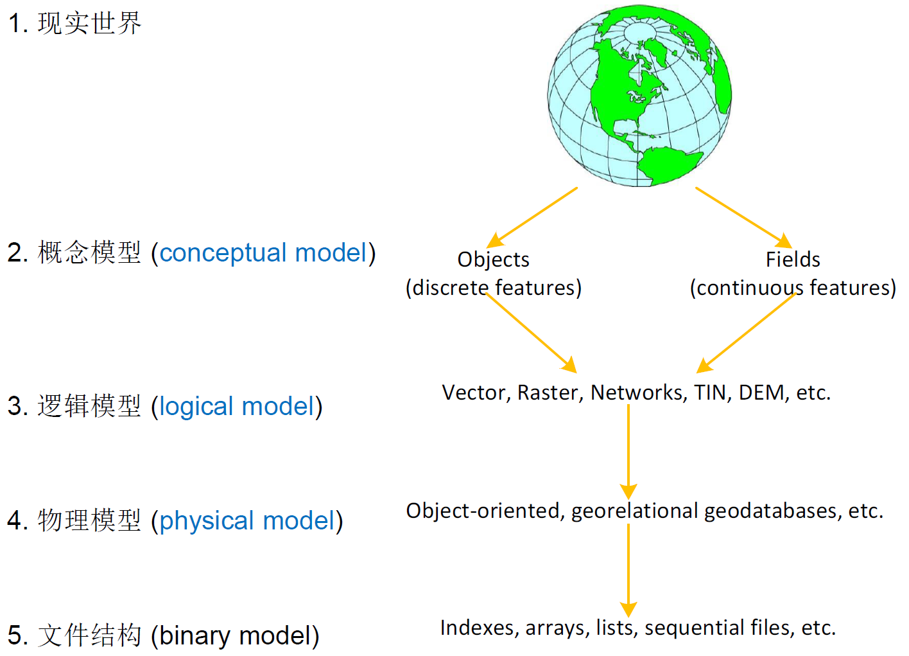

## 1 大数据

大数据既是一类`数据`, 也是一项`技术`, 还是一种`理念`。

 从数据中提取知识需要：存储、管理、分析、可视化等操作。

大数据的特点:

* 大数据量、结构化、”小分析学“
  
    `select *`无法处理返回的TB级数据。替代方案是SQL的聚集分析，如结合`group by`的count、sum、max、min、avg等。

* 大数据量、非结构化、“大分析学”
  
    使用回归、分类、聚类、搜索、推荐等数据挖掘和机器学习方法。

* 大速度
  
    对电子交易、实时网页广告投放、实时客户针对营销、移动社交网络等应用，处理“灭火水龙带”式涌入的数据。

* 大多样性
  
    电子表格、网页、XML、关系型数据库、几何等数据格式。

## 2 空间数据

从空间数据到文件结构逐层抽象。

## 3 空间分析

* 度量(Measurements): 物理距离、长度、面积等

* 领近(Proximal): 是否在某一距离范围内

* 拓扑(Topological): 空间相等、包含、穿越、相接、相交等

* 方向(Directional): 东、南、西、北、左、右

## 4 空间计算(Spatial Computing)

???+ Note inline end

    这门课程的核心就是**空间计算**。  
    空间计算思想: 空间关联、时空查询

**空间计算**是一系列通过`理解(understanding)`物质世界、`了解(knowing)`和`交流(communicating)`我们与工作场所的关系并在这些场所中`导航(navigating)`，来改变我们的生活的想法和技术。

## 5 参考学习资料

* Database System Concepts, Abraham Silberschatz, Henry F.Korth, and S.Sudarshan, 7th edition.

* 空间数据库管理系统概论, 程昌秀编著

* Spatial Databases: A Tour, ShashiShekharand Sanjay Chawla.

* [Stanford Online Course-Introduction to Databases](https://online.stanford.edu/courses/soe-ydatabases-databases)

* [Minnesota Course-Spatial Data Science](https://www.spatial.cs.umn.edu/Courses/Fall22/5715/)

