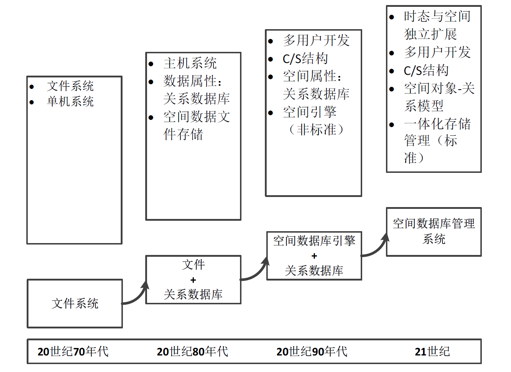

## 1 关系数据库基本概念

### 1.1 数据模型

**数据模型**是用来描述数据、组织数据和对数据进行操作的模型。

* **逻辑数据模型(logical model)** 直接面向数据库的逻辑结构,常有一组严格定义的、无二义性的语法和语义的数据库语言, 用于定义、操纵数据库中的数据。
  
    > 逻辑数据模型与DBMS有关，DBMS以所支持的逻辑数据模型来分类。  
    > 用概念数据模型表示的数据必须转化为逻辑数据模型表示的数据，才能在DBMS中实现。  
    > 逻辑数据模型既要面向用户, 也要面向实现。

    !!! tip "逻辑数据模型的类型"
        * 层次模型(Hierarchical Model)
        * 网状模型(Network Model)
        * 关系模型(Relational Model)
        * 面向对象模型(Object Oriented Model)
        * 对象关系模型(Object Relational Model)

* **物理数据模型(physical model)** 是对数据最低层的抽象, 它描述数据在磁盘或磁带上的存储方式和存取方法, 面向计算机系统。

    > 每种逻辑数据模型在实现时，都有其对应的物理数据模型。  
    > 物理数据模型的实现不但与DBMS有关，还与操作系统和硬件有关。

**数据模型的内容**:  

* 数据结构 `静态特性`
* 数据操纵 `动态特效`
* 完整性约束 `完整性约束条件`
        
    !!! example "层次模型分析"
        * **数据结构–树**  
          有且只有一个结点没有父结点，这个结点称为根结点  
          根以外的其它结点有且只有一个父结点
        *  **数据操作**  
          查询、插入、删除、更新
        * **完整性约束**  
          除根结点外，无父结点的结点无法插入  
          删除父结点时，同时也删除其所有子结  
        ---
        * 优点：  
          层次数据模型简单，对具有一对多的层次关系的部门描述自然、直观，容易理解;  
          性能优于关系模型，不低于网状模型;  
          层次数据模型提供了良好的完整性支持;  
        * 缺点：  
          多对多联系表示不自然;  
          对插入和删除操作的限制多;  
          查询子结点必须通过父结点;  
          层次命令趋于程序化

    !!! example "网状模型分析"
        * **数据结构–图**  
          允许多个结点没有父结点  
          允许结点有多个父结点  
          允许两个结点之间有多种联系(复合联系)
        *  **数据操作**  
          查询、插入、删除、更新
        * **完整性约束**    
        ---
        * 优点：  
          能够更为直接地描述现实世界，如一个结点可以有多个父结点;  
          具有良好的性能，存取效率较高;  
        * 缺点：  
          结构比较复杂，而且随着应用环境的扩大，数据库的结构变得越来越复杂，不利于最终用户掌握;  
          DDL (Data Definition Language)、DML (Data Manipulation Language)语言复杂，用户不容易使用;  

    !!! example "关系模型的主要优点"
        * **简单**，一个数据库由多个关系组成，每一个关系就是一个规范化了的二维表，关系模型中的许多概念与二维表是一一对应的，普通用户容易理解。  
        * **易访问**，可以使用高级的数据查询语言构造出复杂的查询，对数据库中的数据进行访问点  

!!! note inline end "模式与实例"
    模式相对稳定, 反映数据结构及联系;  
    实例相对变动, 反映数据库某一时刻的状态。

### 1.2 三级模式
**模式(schema)**定义或描述一个数据集合。
    
**三级模式**:
  
* **模式**  
  用逻辑数据模型对数据库中全部数据的逻辑结构和特性的描述;   
  是数据库所有用户的公共数据视图。
  > 一个数据库(的关系)只有一个模式。    

* **外模式(子模式|用户模式)**  
  对用户所用到的那部分数据的描述;   
  > 一个数据库(的关系)可以有多个外模式;  
  > 外模式是模式的一部分或是从模式推导而来的。

* **内模式(存储模式)**  
  用物理数据模型对数据的描述; **数据物理结构和存储方式**的描述, 是数据在数据库内部的表示方式。
  > 一个数据库(的关系)只有一个内模式;  
  > 内模式定义与修改是DBA(DatabaseAdministrators)的责任。

**模式映像**:

* **外模式/模式映像**  
  每个外模式对应一个该映象;   
  映象定义通常包含在各自`外模式`的描述中.  
  > 用途: 保证数据(与程序)的**逻辑独立性**.  
  > 当模式改变时，数据库管理员修改有关的外模式／模式映象，使外模式保持不变; 应用程序是依据数据的外模式编写的，从而应用程序不必修改，保证了数据与程序的逻辑独立性。  
* **模式/内模式映象**   
  定义数据的逻辑结构与存储结构间对应关系;  
  映象定义通常包含在`模式`描述中.
  > 用途: 保证数据(与程序)的**物理独立性**.  
  > 当数据库的存储结构改变了(例如，选用了另一种存储结构)，数据库管理员修改模式／内模式映象，使模式保持不变; 应用程序不受影响，保证了数据与程序的物理独立性。

## 2 空间数据库基本概念
### 2.1 空间数据
**空间数据**是以地球表面空间位置为参照的自然、社会和人文经济景观数据。广义上包括文字、数字、图形、影像、声音、图像等多种表现形式。分为**矢量数据**和**栅格数据**。

**矢量数据**：一种用点、线、面等基本空间要素来表示人们赖以生存的自然世界的数据。  
**空间实体**：不可再分的最小单元现象；是对存在于这个自然世界中地理实体的抽象；包括包括点、线、多边形等基本类型。
???+ example "空间实体举例"
    * 一根电线杆 → 点   
    > 所处的位置信息、电线杆高度及其他相关信息  

    * 一条道路 → 线  
    > 道路长度、宽度、起点、终点及道路等级等相关信息  

    * 一个湖泊 → 多边形  
    > 湖泊的周长、面积和水质等信息
  
**栅格数据**：把地理空间中的事物和现象作为连续的变量或体看待。  
> 将地面划分为均匀的网格，每个网格作为一个像元，像元的位置由所在列和行号确定，像元所含有的代码表示其属性类型或仅是与其属性记录相联系的指针。

### 2.2 空间数据的特征
* **空间特征**  
  空间对象都有空间坐标,即空间对象隐含了`空间分布特征`;  
  除了属性索引外，还需要建立`空间索引`。
* **非结构化特征**  
  不方便用数据库二维逻辑表来表现的数据为非结构化数据, 空间数据是一种`非结构化数据`;   
  空间实体是不定长、非原子甚至嵌套的。 
* **空间关系特征**  
  空间数据包括空间坐标和拓扑关系。    
* **时态特征**  
  反映地理实体的状态和演变过程的重要组成部分。
  > 现有的空间数据库基本不具有管理空间数据的时间动态性，只是描述数据的`瞬时状态`。
* **多尺度特征**  
  `空间多尺度`指根据地学过程或地理地球系统中规模的大小,可分为不同的层次;   
  `时间多尺度`指地学过程或地理特征具有一定的自然节律性,其时间周期长短不一。

### 2.3 空间数据库
**空间数据库**：在地球表面某一范围内与空间地理相关、反映某一主题信息的数据集合。
> 空间数据库是以**空间目标**作为存储对象的专业数据库

要求: 按一定的`数据模型`组织、描述和存储，具有较小的`冗余度`、较高的`数据独立性`和`易扩展性`，并可为各种用户`共享`。 

**三大要素**: 空间数据类型、空间分析和空间索引。

**三层架构**：Spatial Application <> Spatial DB <> DBMS

**特点**:  

* 数据量大  
* 空间数据与属性数据的集合  
* 应用广泛  
### 2.4 空间数据库系统
空间数据库管理系统(Spatial Database Management System,SDBMS): 由空间数据库及其管理软件、应用软件组成, 是存储介质、处理对象和管理系统的集合体。现有的SDBMS有: 

* [Oracle Spatial](https://www.oracle.com/database/spatial/)
* [PostgreSQL PostGIS](https://postgis.net/)
* [DB2 Spatial Extender](https://www.ibm.com/docs/en/db2/11.1?topic=data-db2-spatial-extender)

功能:  

* 空间数据定义与操纵(SDDL,SDML)  
* S.D的组织、存储和管理(存取效率)  
* 后台的事务管理和运行管理(DBA)  
* 数据库的建立与维护

组成:   

* SDB  
* 空间数据库管理系统  
* 数据库管理员  
* 用户和应用程序 

## 3 空间数据管理技术的产生与发展

### 3.1 文件系统
加拿大政府从20世纪60年代中期开始，历经10年时间，研发了世界上第一个地理信息系统——加拿大地理信息系统(CGIS)，这是第一代空间应用系统。

### 3.2 文件与关系数据库混合系统
第二代空间应用系统——混合管理系统。

* 文件系统管理几何图形数据   
* 关系数据库管理属性数据  
* 联系通过目标标识或内部连接码进行(对象唯一标识符OID)  

### 3.3 空间数据引擎
第三代空间应用系统——空间数据引擎

* 图形坐标数据作为一个二进制数据类型，由数据库管理系统进行存储;
* SDE提供一组空间数据的操作函数，完成空间数据的转换，以及数据的索引调度和空间数据的存储管理

### 3.4 对象关系型数据库管理系统
第四代空间应用系统——对象关系型数据库管理系统 (Object-relational database management system, ORDBMS)

* 支持SQL，具有良好的通用性;  
* 具有面向对象特性，支持复杂对象及其行为。  
* 能够直接存储和管理非结构化的空间数据;   
* 对各种空间对象, 操作函数及其索引预先定义, 形成不同空间数据类型, 支持空间数据存储管理分析

## 4 空间数据库标准
* 开放地理空间信息协会(Open Geospatial Consortium, OGC)的**Simple Feature Access SQL (SFA SQL)**  
  第一部分([Part1 Common Architecture](https://www.ogc.org/standard/sfa/))定义几何对象的通用架构，描述了通用的简单要素地理集合对象模型，及集合对象的不同表达方式和空间参考系统的表达方式，具有平台独立性。  
  第二部分([Part2: SQL Option, SFA SQL](https://www.ogc.org/standard/sfs/))定义了第一部分定义的简单要素模型在数据库中的实现，给出了内模式下几何类型(geometry type)的定义及相关实现。 
* 国际标准化组织/国际电工委员会第一联合技术委员会/数据管理和交换分技术委员会(ISO/IEC JTC1 SC32)的**SQL Multimedia Part3: Spatial, SQL/MM**  
  [SQL/MM](https://www.iso.org/obp/ui/#iso:std:iso-iec:13249:-3:ed-5:v1:en)第三部分空间定义了矢量数据存储与检索的相关标准，解释了基于这些数据类型如何使用存储、获取和处理空间数据。

!!! tip "SFA SQL与SQL/MM对比"
    SFA SQL在`标记文本类型、空间数据存储`实现上比SQL/MM定义的更宽泛；  
    SQL/MM涉及了SFA SQL尚未涉及的`拓扑数据结构、网络模型`等方面的内容。
    ---
    **PostGIS更符合SFA SQL标准**  
    **Oracle Spatial更兼容SQL/MM标准**  