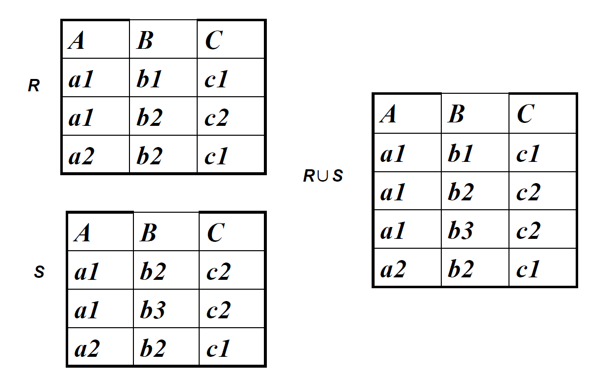
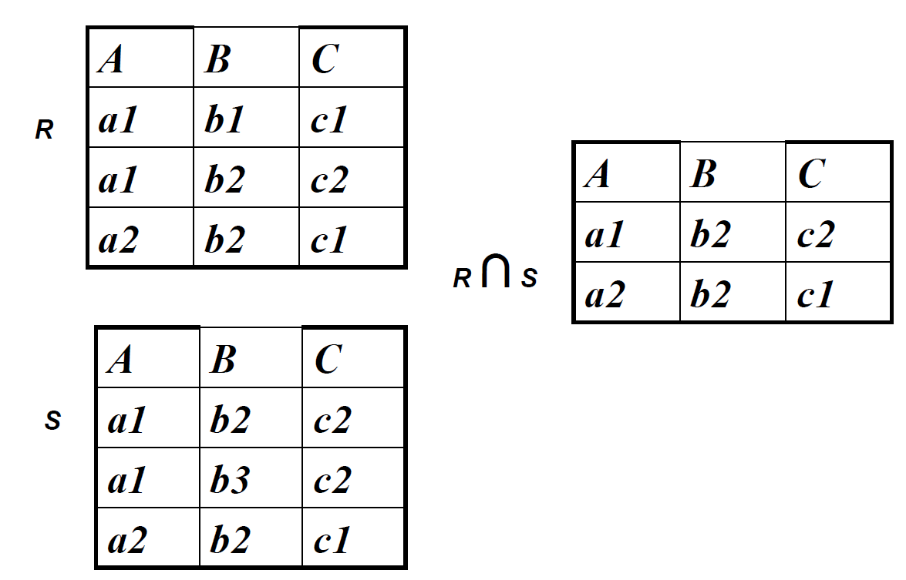
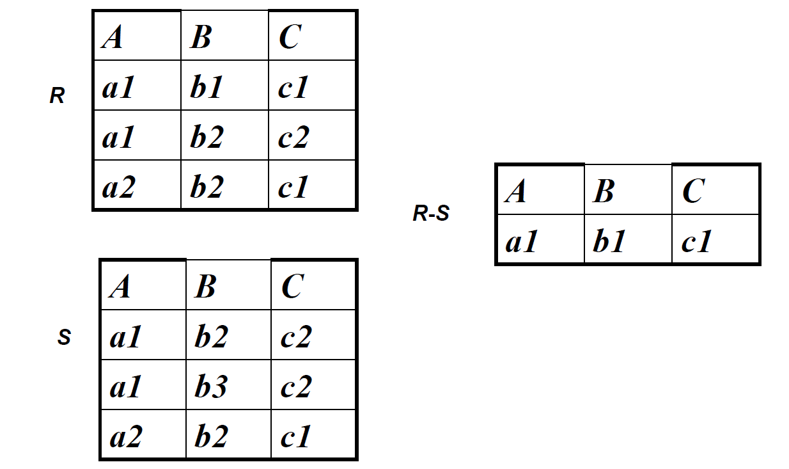
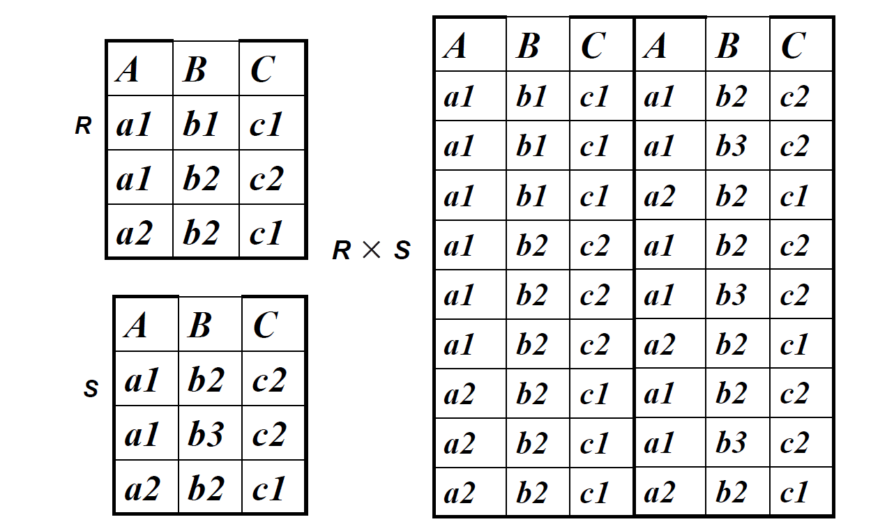
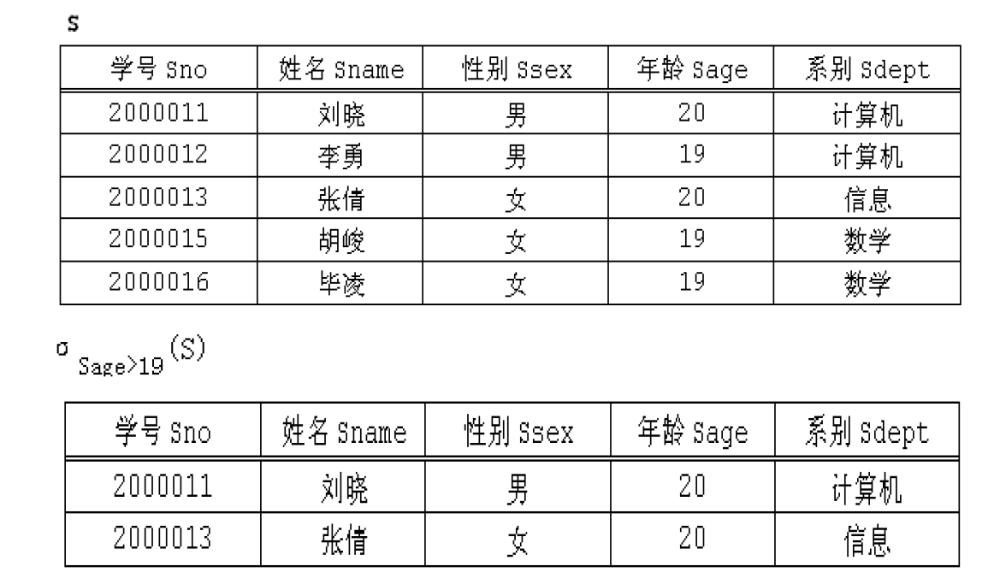
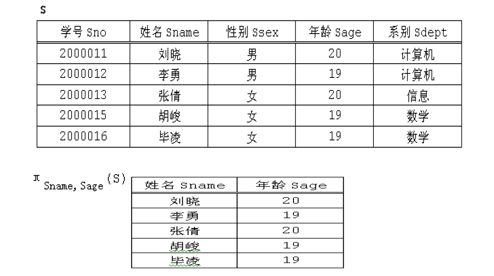
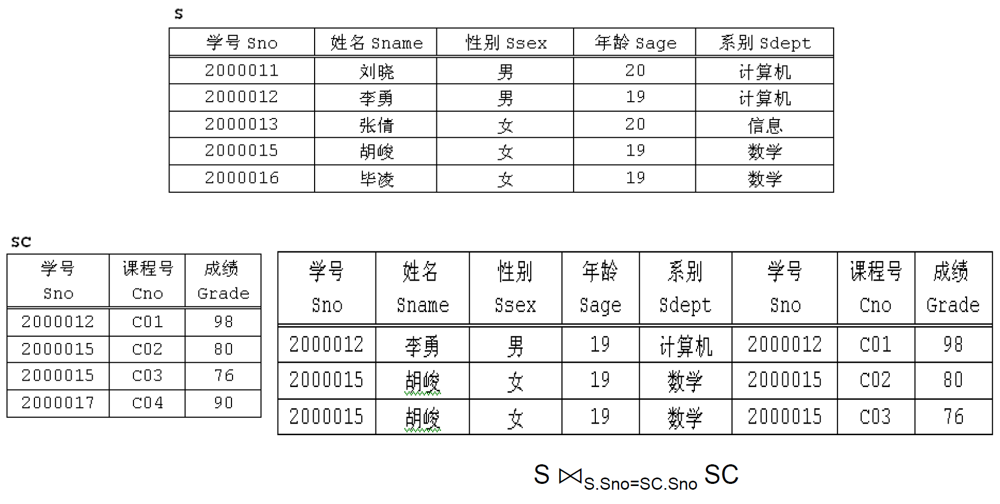
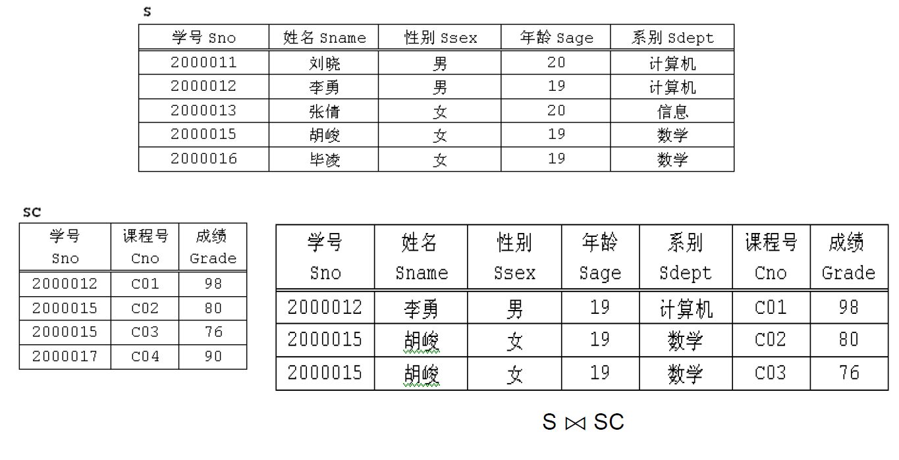
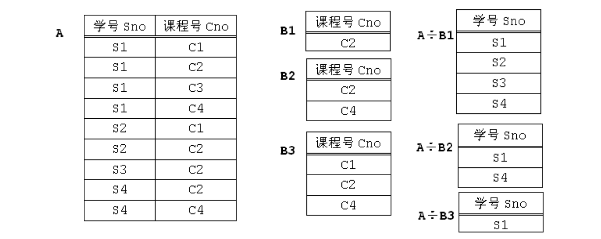

## 1. 关系模型

关系模型是一种数据模型，它和一般的数据模型一样，由如下三部分组成：

- 关系数据结构

- 关系数据操作

- 关系完整性约束

### 1.1 关系数据结构

#### 1.1.1 关系模型可以看成简单的二维表

单一的数据结构：`关系`

> 在关系模型中，无论是**实体**还是实体间的各种**联系**均用关系来表示。

数据的逻辑结构：`二维表`

> 从用户角度，关系模型中数据的逻辑结构是一张**二维表**。具体来说，是一张**非嵌套**的二维表。

!!! note inline end

	嵌套表无法在数据库中直接等价表示, 其不满足关系数据库第一范式

关系模型采用**关系(Relation)**作为数据结构，直观地讲，关系就是简单的表(Table)，由三部分构成:

- 表名（关系名）
- 表头（关系模式）
- 数据（关系实例）

#### 1.1.2 域和笛卡尔积

域(Domain)： 一组具有相同数据类型的值的集合。

>  整数、实数都是域。域可以被理解为程序设计语言中的数据类型，如C语言中的int，float等。

笛卡尔积(Cartesian Product)： 给定一组域 $D_1，D_2，…，D_n$，$D_1，D_2，…，D_n$的`笛卡尔积`为：
$$
D_1 \times D_2 \times \cdots \times D_n = {(d_1, d_2, \cdots d_n) | d_i \in D_i, i=1,2,\cdots,n}
$$
其中，每个元素$(d_1, d_2, \cdots d_n)$ 叫作一个n元组($N \text{-} Tuple$)或简称元组(Tuple)。元素中的每一个值 $d_i$ 叫作一个分量(Component)。

#### 1.1.3 关系模型的几个定义

属性(Attribute)：关系中的一列即为一个属性。  

域：属性的取值范围称为该属性的域。  

码：可以唯一确定一个元组的最小属性集合称为`候选码(Candidate Key)`，或简称为码(Key)。  

元组：每个属性的具体数值组合，即二维表里的一行。

分量：元组中的一个属性值。  

关系模式(Relation Schema)：对关系的描述，一般表示为：关系名(属性1，属性2，…，属性n)。  

关系实例(Relation Instance)：关系的内容。

!!! note 
	一个关系由关系名、关系模式和关系实例组成，分别对应于表名、表头和表中的数据。关系名和关系模式相对稳定，关系实例会随时间而发生变化。
    > 如：
    > 关系名：学生  
    > 关系模式：学生(学号，姓名，专业)  
    > 关系实例：(321010\****, 张三, GIS)  
    
	数据库(Database) 是关系的集合。

#### 1.1.4 关系的三种类型

- 查询关系：通常又称为基本表或基表)，基本表是实际存在的表，是实际存储数据的逻辑表示。
- 查询表：查询结果对应的表。
- 视图表：由基本表或其他视图表导出的表，是虚表，不对应实际存储的数据

### 1.2 关系数据操作

**特点：** `集合`操作方式，即操作的对象和结果都是集合。

**常用关系操作**：

- 查询：选择、投影、连接、除、并、交、差

    > 查询的表达能力是关系操作中最主要的部分。

- 数据更新：插入、删除、修改

**关系数据语言的种类**:

- 关系代数语言：用对关系的运算来表达查询要求
- 关系演算语言：用谓词来表达查询要求
- 介于关系代数和关系演算之间的语言，即`结构化查询语言SQL`

### 1.3 关系完整性约束

关系模型的完整性规则是对关系的某种约束条件。

三类完整性约束：实体完整性、参照完整性、用户定义完整性。

> 实体完整性和参照完整性是关系模型必须满足的完整性约束条件，被称作是关系的两个不变性，应该由关系数据库系统自动支持。

!!! note inline end "区分候选码与主码"
    主码是从[候选码](#cand-key)中选出的一个特定的候选码，用来作为表的主键。一个表只能有一个主码，但可以有多个候选码。

#### 1.3.1 实体完整性(Entity Integrity)

若属性A是基本关系R的主码(Primary Key)，则任何一个元组在属性A上不能取空值(NULL)。

> NULL表示"unknown" 或"undefined"的特殊值。

#### 1.3.2 参考完整性(Referential Integrity)

也称为引用完整性。在关系模型中，实体以及实体之间的联系都是用关系来表示的，这样就自然存在着关系与关系之间的引用。

参照完整性规则就是定义外键与被参照的主键之间的引用规则。外键一般应符合：值为空或者等于其所参照的关系中的某个元组的主码。

???+ example "参考完整性举例"
    选课关系作为参照关系：选课(课程号，成绩，学号)，"学号"是选课关系的外码。
    

    学生关系作为被参照关系：学生(学号，姓名，性别，专业)，"学号"是学生关系的主码。
    
    选课关系里的"学号"参照自学生关系的"学号"。

#### 1.3.3 用户定义完整性(User-defined Integrity)

举例：课程(课程号，课程名，学分)  

- “课程号”属性必须取唯一值
- 非主属性“课程名”不能取空值
- “学分”属性只能取值{1，2，3，4}

## 2. 关系代数

### 2.1 概述

**关系代数**：一种抽象的查询语言；用对关系的运算来表达查询。

**关系代数运算的三个要素**：

- 运算对象：关系
- 运算结果：关系
- 运算符：四类。集合运算符、专门的关系运算符、算数运算符、逻辑运算符

**四类关系代数运算符**：

- 集合运算符

    将关系看成元组的集合；运算是从关系的“水平”方向即**行**的角度来进行。

- 关系运算符

    不仅涉及行而且涉及列。

- 算数运算符

    辅助专门的关系运算符进行操作。

- 逻辑运算符

    辅助专门的关系运算符进行操作

<table "style="width: 120%; border-collapse: collapse; " align="center">
    <tr>
        <td style="border: 1px solid black; text-align: center; padding: 15px; padding-top: 10px; padding-bottom: 10px;"><b>集合运算符</b></td>
        <td style="border: 1px solid black; text-align: center; padding: 15px; padding-top: 10px; padding-bottom: 10px;">含义</td>
        <td style="border: 1px solid black; text-align: center; padding: 15px; padding-top: 10px; padding-bottom: 10px;"><b>关系运算符</b></td>
        <td style="border: 1px solid black; text-align: center; padding: 15px; padding-top: 10px; padding-bottom: 10px;">含义</td>
        <td style="border: 1px solid black; text-align: center; padding: 15px; padding-top: 10px; padding-bottom: 10px;"><b>比较运算符</b></td>
        <td style="border: 1px solid black; text-align: center; padding: 15px; padding-top: 10px; padding-bottom: 10px;">含义</td>
        <td style="border: 1px solid black; text-align: center; padding: 15px; padding-top: 10px; padding-bottom: 10px;"><b>逻辑运算符</b></td>
        <td style="border: 1px solid black; text-align: center; padding: 15px; padding-top: 10px; padding-bottom: 10px;">含义</td>
    </tr>
    <tr>
        <td style="border: 1px solid black; text-align: center; padding: 15px; padding-top: 10px; padding-bottom: 10px;">$\cup$</td>
        <td style="border: 1px solid black; text-align: center; padding: 15px; padding-top: 10px; padding-bottom: 10px;">并</td>
        <td style="border: 1px solid black; text-align: center; padding: 15px; padding-top: 10px; padding-bottom: 10px;">$\sigma$</td>
        <td style="border: 1px solid black; text-align: center; padding: 15px; padding-top: 10px; padding-bottom: 10px;">选择</td>
        <td style="border: 1px solid black; text-align: center; padding: 15px; padding-top: 10px; padding-bottom: 10px;">$\gt$</td>
        <td style="border: 1px solid black; text-align: center; padding: 15px; padding-top: 10px; padding-bottom: 10px;">大于</td>
        <td style="border: 1px solid black; text-align: center; padding: 15px; padding-top: 10px; padding-bottom: 10px;">$\lnot$</td>
        <td style="border: 1px solid black; text-align: center; padding: 15px; padding-top: 10px; padding-bottom: 10px;">非</td>
    </tr>
    <tr>
        <td style="border: 1px solid black; text-align: center; padding: 15px; padding-top: 10px; padding-bottom: 10px;">$-$</td>
        <td style="border: 1px solid black; text-align: center; padding: 15px; padding-top: 10px; padding-bottom: 10px;">差</td>
        <td style="border: 1px solid black; text-align: center; padding: 15px; padding-top: 10px; padding-bottom: 10px;">$\pi$</td>
        <td style="border: 1px solid black; text-align: center; padding: 15px; padding-top: 10px; padding-bottom: 10px;">投影</td>
        <td style="border: 1px solid black; text-align: center; padding: 15px; padding-top: 10px; padding-bottom: 10px;">$\ge$</td>
        <td style="border: 1px solid black; text-align: center; padding: 15px; padding-top: 10px; padding-bottom: 10px;">大于等于</td>
        <td style="border: 1px solid black; text-align: center; padding: 15px; padding-top: 10px; padding-bottom: 10px;">$\land$</td>
        <td style="border: 1px solid black; text-align: center; padding: 15px; padding-top: 10px; padding-bottom: 10px;">与</td>
    </tr>
    <tr>
        <td style="border: 1px solid black; text-align: center; padding: 15px; padding-top: 10px; padding-bottom: 10px;">$\cap$</td>
        <td style="border: 1px solid black; text-align: center; padding: 15px; padding-top: 10px; padding-bottom: 10px;">交</td>
        <td style="border: 1px solid black; text-align: center; padding: 15px; padding-top: 10px; padding-bottom: 10px;">$\Join$</td>
        <td style="border: 1px solid black; text-align: center; padding: 15px; padding-top: 10px; padding-bottom: 10px;">连接</td>
        <td style="border: 1px solid black; text-align: center; padding: 15px; padding-top: 10px; padding-bottom: 10px;">$\lt$</td>
        <td style="border: 1px solid black; text-align: center; padding: 15px; padding-top: 10px; padding-bottom: 10px;">小于</td>
        <td style="border: 1px solid black; text-align: center; padding: 15px; padding-top: 10px; padding-bottom: 10px;">$\lor$</td>
        <td style="border: 1px solid black; text-align: center; padding: 15px; padding-top: 10px; padding-bottom: 10px;">或</td>
    </tr>
    <tr>
                <td style="border: 1px solid black; text-align: center; padding: 15px; padding-top: 10px; padding-bottom: 10px;">$\times$</td>
        <td style="border: 1px solid black; text-align: center; padding: 15px; padding-top: 10px; padding-bottom: 10px;">广义笛卡尔积</td>
        <td style="border: 1px solid black; text-align: center; padding: 15px; padding-top: 10px; padding-bottom: 10px;">$\div$</td>
        <td style="border: 1px solid black; text-align: center; padding: 15px; padding-top: 10px; padding-bottom: 10px;">除</td>
        <td style="border: 1px solid black; text-align: center; padding: 15px; padding-top: 10px; padding-bottom: 10px;">$\le$</td>
        <td style="border: 1px solid black; text-align: center; padding: 15px; padding-top: 10px; padding-bottom: 10px;">小于等于</td>
        <td style="border: 1px solid black; text-align: center; padding: 15px; padding-top: 10px; padding-bottom: 10px;"></td>
        <td style="border: 1px solid black; text-align: center; padding: 15px; padding-top: 10px; padding-bottom: 10px;"></td>
    </tr>
    <tr>
        <td style="border: 1px solid black; text-align: center; padding: 15px; padding-top: 10px; padding-bottom: 10px;"></td>
        <td style="border: 1px solid black; text-align: center; padding: 15px; padding-top: 10px; padding-bottom: 10px;"></td>
        <td style="border: 1px solid black; text-align: center; padding: 15px; padding-top: 10px; padding-bottom: 10px;"></td>
        <td style="border: 1px solid black; text-align: center; padding: 15px; padding-top: 10px; padding-bottom: 10px;"></td>
        <td style="border: 1px solid black; text-align: center; padding: 15px; padding-top: 10px; padding-bottom: 10px;">$=$</td>
        <td style="border: 1px solid black; text-align: center; padding: 15px; padding-top: 10px; padding-bottom: 10px;">等于</td>
        <td style="border: 1px solid black; text-align: center; padding: 15px; padding-top: 10px; padding-bottom: 10px;"></td>
        <td style="border: 1px solid black; text-align: center; padding: 15px; padding-top: 10px; padding-bottom: 10px;"></td>
    </tr>
    <tr>
        <td style="border: 1px solid black; text-align: center; padding: 15px; padding-top: 10px; padding-bottom: 10px;"></td>
        <td style="border: 1px solid black; text-align: center; padding: 15px; padding-top: 10px; padding-bottom: 10px;"></td>
        <td style="border: 1px solid black; text-align: center; padding: 15px; padding-top: 10px; padding-bottom: 10px;"></td>
        <td style="border: 1px solid black; text-align: center; padding: 15px; padding-top: 10px; padding-bottom: 10px;"></td>
        <td style="border: 1px solid black; text-align: center; padding: 15px; padding-top: 10px; padding-bottom: 10px;">$\ne$</td>
        <td style="border: 1px solid black; text-align: center; padding: 15px; padding-top: 10px; padding-bottom: 10px;">不等于</td>
        <td style="border: 1px solid black; text-align: center; padding: 15px; padding-top: 10px; padding-bottom: 10px;"></td>
        <td style="border: 1px solid black; text-align: center; padding: 15px; padding-top: 10px; padding-bottom: 10px;"></td>
    </tr>
</table>

### 2.2 传统的集合运算

**并**

{.img70}

**交**

{.img70}

**差**

{.img70}

**广义笛卡尔积**

{.img70}

### 2.3 专门的关系运算

**选择**

选择针对单个关系中的数据进行操作，属于一元运算符，是指**从关系中选择若干行**。

???+ example "选择的例子"
    $\sigma_{Sage>19}(S)$ 表示：使用选择操作符(σ)从学生关系S中选择出哪些年龄大于19岁的学生。  
    
    查询表达式中的下标“Sage>19”给出的是选择条件，只有符合该条件的元组才可以被返回到结果中。
    {.img60}

**投影**

投影操作($\pi$)是指**从关系中选择若干列**。

???+ example "投影的例子"
    $\pi_{Sname, Sage}(S)$ 表示：从学生关系S中找出所有学生的名字和年龄。
    
    查询表达式中的下标“Sage>19”给出的是选择条件，只有符合该条件的元组才可以被返回到结果中。
    
    {.img60}

**连接**

`Theta-Join`是最有用的操作之一。

连接运算的含义：从两个关系的笛卡尔积中选取属性间满足一定条件的元组。
$$
R \Join_{条件} S
$$
其中条件一般形式是$A \  \theta \ B$, $\theta = \lbrace =, \gt, \ge, \lt, \le, \neq \rbrace$，A是关系R中的属性或者是一个常数，B是关系S中的属性或者是一个常数，A和B必须是同一个定义域(相同的数据类型)。还可以用逻辑运算符和上面的一般形式构成更复杂的条件。

两类常用的连接运算：

- **等值连接(Equal Join)**

    当条件 $A \theta B$ 中$θ$为"="的连接运算称为等值连接。
  
    含义是：从关系R与S的广义笛卡尔积中选取A、B属性值相等的那些元组。
    
    ???+ example "等值连接的例子"
    
    	

- **自然连接(Natural Join)**

	!!! note inline end "自然连接的特点"
        一般的连接操作是从**行**的角度进行运算。自然连接还需要取消重复列，所以是同时从**行和列**的角度进行运算。
  
    自然连接是一种特殊的等值连接。
  
    > 自然连接要求关系R中的属性A和关系S中的属性B名字相同；
    > 
    > 在返回结果时还会把结果中重复的属性列去掉(去重)。
  
    含义是：R和S具有相同的属性组A(B)，提取出属性组相同的那些元组。
	
	???+ example "自然连接的例子"
  		
  
	

**除**

除运算可以这样来理解：假设有两个关系A和B，其中A只有两个属性X和Y，B只有一个属性Y(和关系A中的Y属性具有相同的域)，对于A中的每一个x(属性X的取值)所对应的y(属性Y的取值)集合，看它是否包含B中所有的y值，如果包含，则x属于A÷B的结果集。

???+ example "除运算的例子"
	

### 2.4 重命名

辅助操作，对关系名、属性名进行重命名。

用法：

- $\rho_{R(A_1, \cdots, A_n)}(S) $：对关系名和属性名进行重命名
- $\rho_{R}(S) $：对关系名进行重命名
- $\rho_{A_1, \cdots, A_n}(S) $：对属性名进行重命名

用途：

- 统一参与集合运算的关系模式的属性名

    $\rho_{c(name)}(\pi_{Sname}(Student)) \cup \rho_{c(name)}(\pi_{Cname}(Course))$

- 便于同一关系的“自连接”

    $\rho_{c1(no1, n1, p1, c)}()Course \Join \rho_{c2(no2, n2, p2, c)}(Course)$
